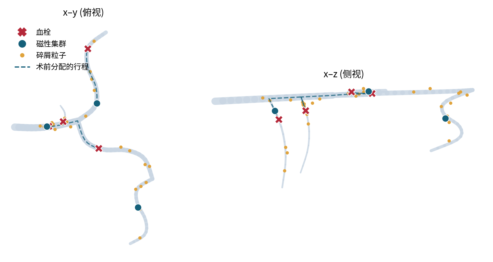
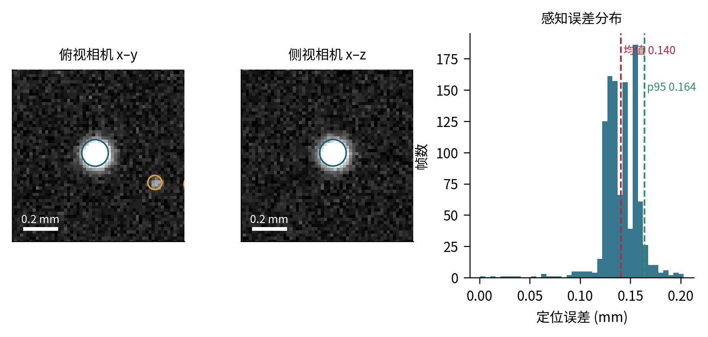
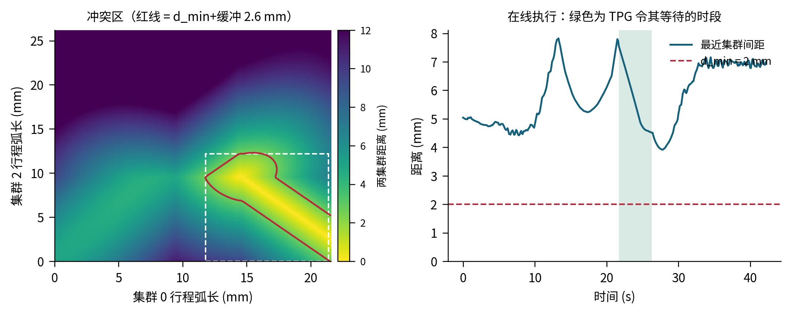
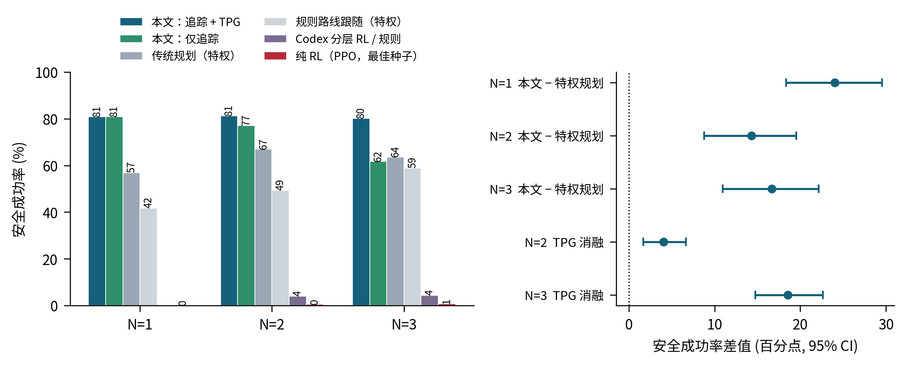
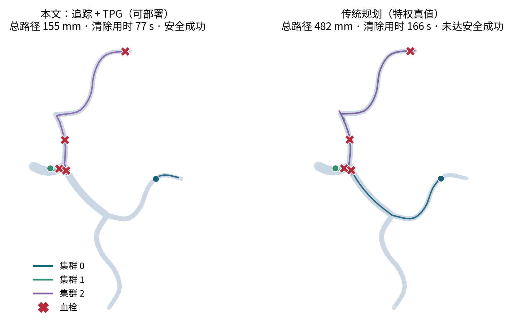
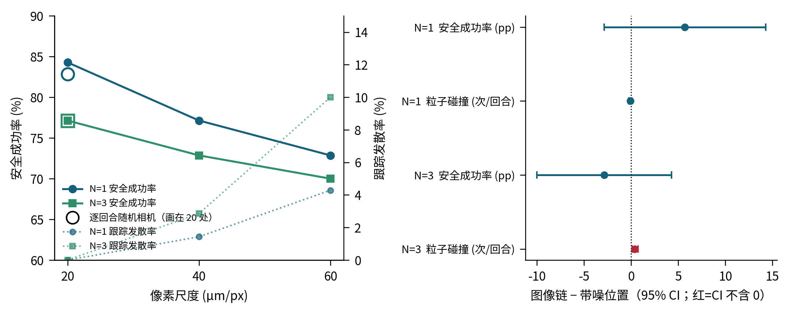

# 血管内磁性微机器人集群取栓：方法整合与 NMI 投稿初稿

版本：2026-10-06。数据来源：`research/validation/BENCHMARK_V2_UNION_20261005/`（主基准）、
`research/validation/IMAGE_SENSING_PROBE_20261005/`（图像感知链）、
`research/validation/IMAGE_CAMERA_SWEEP_20261005/`（成像质量敏感性）、
`research/runs/BENCH_PPO_UNION_20261005/`（纯 RL）。本文件中所有数字均来自上述目录的 jsonl 原始记录。

---

## 0. 一页摘要

我们在三维血管树仿真中研究多个磁性微机器人集群协同取栓。核心主张不是"又一个 RL 控制器"，
而是：**在只允许成像可得信息的条件下，把多集群取栓的安全成功率做到显著高于使用仿真真值的传统规划基线。**

三个部件：

1. **术前测地分配（Allocation A）**——按术前影像地图上的测地距离做最小化完工时间的血栓分配；
2. **时序计划图间距协调（TPG）**——把"集群间最小安全距离"从在线侧向避让改为术前时间排序；
3. **可部署纯追踪 + 安全层**——只用成像估计沿术前路线做纯追踪，近距离粒子触发斥力与等待。

感知不是理想化的：我们实现了**图像感知链**（双视角合成相机成像 → 像素级检测 → 双视角三维融合 →
联合跟踪），控制器读不到仿真真值。在 14 个解剖、N=1/2/3 的配对场景下：

| 方法 | 信息 | N=1 | N=2 | N=3 |
|---|---|---:|---:|---:|
| 本文（追踪 + TPG） | 可部署 | 81.0 | 81.2 | 80.2 |
| 传统规划（plan_route） | **特权**（仿真真值） | 56.9 | 66.9 | 63.6 |
| 规则路线跟随 | **特权** | 41.7 | 49.3 | 58.8 |
| Codex 分层 RL / 规则 TPG | 实测 | — | 4.0 | 4.0–4.8 |
| 纯 RL（PPO，3 种子） | 可部署 | ≤0.0 | ≤0.5 | ≤0.7 |

Safe Success（%），每格 420 回合。即使对手使用仿真真值，本文方法在 N=1 高 24.1 pp、N=2 高 14.3 pp、
N=3 高 16.6 pp。

---

## 1. 任务设定

血管树内有 N 个磁性集群（半径 0.08 mm）和 M 个血栓。每个集群需要导航到分配给它的血栓并停留溶解，
直到全部血栓清除。管腔内有 32 个随流漂浮的微粒（半径 0.02 mm），代表已脱落的血栓碎屑。

一个回合算**安全成功（Safe Success）**，需要同时满足：

- 全部血栓清除；
- 累计壁接触 < 1.0 robot-second；
- 无粒子接触、无集群间接触；
- 无集群被流冲走丢失；
- 集群间距始终满足 d_min（N > 1 时 2 mm）。

这是主指标。另报原始成功率（只要求清除）、T50/T90/T100、清除率曲线下面积（AUC）、
单位血栓路径长度、壁接触秒数、粒子碰撞事件、间距违规对秒、死锁代理事件、超时率。

14 个解剖覆盖脑动脉（MCA M1 闭塞、ICA 虹吸段、ICA 终末 T 型、基底 - 椎动脉、颈动脉分叉）、
冠脉（左主干分叉、右冠）、肺动脉（鞍状栓）、腹部内脏（肠系膜上动脉、肾动脉）、
外周静脉与动脉（髂静脉 May-Thurner、腘静脉小腿 DVT、股 - 腘动脉 PAD）、脑静脉窦。
其中 5 个（右冠、基底 - 椎动脉、脑静脉窦、肠系膜上动脉、股 - 腘动脉）作为留出解剖，
零样本评估，不参与任何方法的开发或调参（`configs/evaluation_splits.json: anatomy_holdout_v1`，
2026-10-03 即已登记）。

---

## 2. 仿真环境

### 2.1 物理模型

刚体在中心线图上的输运：集群和粒子被约束在管腔内，受流场拖曳和磁驱动命令共同作用，
与壁、与彼此发生接触。关键参数：

| 量 | 值 |
|---|---|
| 集群半径 | 0.08 mm |
| 粒子半径 / 数量 | 0.02 mm / 32 |
| 集群最大速度 | 1.0 mm/s |
| 控制周期 | 0.1 s（10 Hz） |
| 回合时限 | 300 s |
| 溶解速率（总催化速率固定） | 0.36 质量/s |
| 接触判定距离 | 0.12 mm |
| 集群间最小间距 d_min | 2 mm（N > 1） |

### 2.2 一个必须记录的修正：分叉管腔模型

早期版本（`junction_model='graph'`）只在体轴向越过边端点时才切换所在边，并选取方向最对齐的边。
这带来一个**仿真伪影**：在侧支起始处，集群的实际可达空间被隐式状态（"当前在哪条边上"）限制，
物理上应当能进入的锐角侧支进不去，而只要控制器知道仿真的切边规则就能利用它。
这让"知道仿真内部状态"变成了一种隐性特权，与真实环境不符。

现版本（`junction_model='union'`）在分叉两跳邻域内用**管腔并集**（union of tubes）判定：
点只要落在任一管腔胶囊内就是合法的，归属取径向 / 半径比最小的那个胶囊。
这样管腔是纯几何的，不依赖任何隐藏状态，控制器只需要看得见的几何信息。
单元测试 `tests/test_union_junction.py` 验证：并集模型下沿轴前进的体能进入 MCA 穿支
（station 11→83→84→85），graph 模型下不能；两个计算后端在两种解剖上结果一致；默认仍为 graph。

本文所有结果均在 union 模型下重新测量。这一项修正把若干方法的排序改变了（见 §7.6），
因此我们保留了修正前的记录，并在论文中报告这一点。

---

## 3. 信息模型：本文最重要的方法学设计

对照两篇 Nature Machine Intelligence 的工作，我们定义三级信息，并明确每个方法用的是哪一级。

### 3.1 可部署级（本文方法使用）

**允许：**

- **术前地图**：血管中心线图、健康管腔半径、血栓位置（配准后的 CTA）。分配 A 在术前一次算好。
  临床上这是合理的：取栓术前必然有影像。
- **成像测量（10 Hz）**：每个集群的位置，含定位噪声、一帧延迟、偶发丢帧（保持上一估计）；
  离开视野的集群报告为丢失。
- **派生量**：位置估计的有限差分速度；把估计位置与术前中心线做地图匹配得到所在的地图边
  （连续性先验：优先留在上一条边或与其共享分叉的边，除非明显更差）；
  相对地图中心线的径向偏移与**健康**管腔半径。
- **局部检测**：集群附近 1.5 mm 内的粒子位置（带噪），速度由帧间最近邻关联得到；6 mm 内的同伴。
- **血栓状态**：已清除 / 未清除（影像上管腔再通可见）。

**禁止（控制器永不读取）：** 真值位置、仿真的边索引、流场、粒子真实速度、
被血栓占据后的实际（被遮挡）管腔半径、路由表、以及仿真的切边规则。

### 3.2 图像级（本文方法的默认感知，见 §4）

连"带噪的真值位置"都不给：只给渲染出的相机图像，位置必须由检测器从像素中得到。

### 3.3 特权级（仅用于基线，作为上界参照）

直接读仿真真值。传统规划基线用这一级——**我们让对手比自己强**，以免被质疑是靠削弱基线取胜。

### 3.4 与两篇 NMI 的对齐

两篇论文的仿真都**不是**用真实图像数据集训练的，真实图像只出现在实物实验环节：

- **Medany 等（NMI 2025，超声驱动微机器人 + Dreamer）**：仿真是 Pygame 二维环境，
  直接渲染 64×64 RGB 合成图（通道白、障碍深灰、目标红、机器人蓝），作者明确说刻意不完整建模
  PZT 共振与微泡尺寸等动力学。真实图像来自自建实验台（倒置显微镜 + 单反，6–18 fps），
  处理链为裁剪缩放 → SAM 分割 → 形态学闭运算与自适应阈值 → 簇检测 → CSRT 跟踪，跟丢即重检测。
  流程是先在合成图上预训练，再到实物上在线微调（迁移后性能先掉后升，约 1 小时达 90%）。
- **An 等（2026，Turbo，磁性集群 + Transformer RL）**：仿真里策略输入是状态量加 N(0, 0.025)
  观测噪声和多层域随机化；实物部署时顶置相机 / 数字显微镜取图，YOLOv5 检测集群与障碍，
  再图像到世界标定（mm）后送给策略。YOLO 训练集是作者自拍的 110 张实验图增广到 2200 张，
  并非公开数据集；另有一套 LoG + DBSCAN 的集群中心识别流程。

因此我们要对齐的是"**仿真里如何模拟成像**"，而不是去找真实数据集。本文做法：
合成渲染（点扩散模糊、读出与散粒噪声、运动模糊、一帧延迟）+ 像素级检测器 + 双视角三维融合 + 跟踪，
并对成像参数做域随机化（对应 Turbo 的多层域随机化）。检测器可以替换为在渲染图上训练的 CNN，
接口不变。

---

## 4. 图像感知链（`marl/image_sensing.py`）

每个控制周期、每个视角：

1. **跟踪窗口**。以每个集群**自身上一帧估计加速度外推**得到的预测位置为中心，裁一个
   3.2 mm 的方窗（默认 160 px）。窗口位置不使用任何真值。目标跑出窗口即为漏检。
2. **渲染**。落在窗内的集群与粒子画成高斯光斑（σ 由物理半径与光学点扩散函数合成），
   管腔作为对比剂充填的淡背景；叠加高斯读出噪声与散粒噪声；曝光期内多次采样形成运动模糊。
   双视角：俯视看 x/y，侧视看 x/z，共享 x 轴（双平面透视，对应临床双 C 臂 / 两台显微镜）。
3. **检测**。背景减除、高斯平滑、按噪声倍数阈值化、连通域标记、强度加权质心与面积、
   积分光强。这一步替代参考文献中的学习检测器，接口相同。
4. **集群 / 粒子分类**。按**物理单位的积分光强**判别，阈值由相机模型与已知体半径标定一次
   （相当于一个见过集群图像的检测器所具备的知识）。
5. **三维融合与联合跟踪**。两视角共享 x 轴，所有 x 一致的俯视 / 侧视 blob 配对构成三维假设
   （含"鬼影"）；再对所有轨迹做**联合指派**，每条轨迹取一个假设或不取，
   合并光斑可被两条轨迹共享但要付代价。被合并光斑测到的坐标在合并期间按合并前速度外推。

### 4.1 三次迭代，每次都由观察到的失败驱动

| 版本 | 做法 | 观察到的失败 | N=3 Safe |
|---|---|---|---:|
| v1 | 最近邻关联 | 两集群在某视角重叠时互换身份，随后持续外推直至发散 | −7.1 pp |
| v2 | 配对三维点上做匈牙利指派 | 两集群共享 x 与另一坐标时产生鬼影，集群被错误 z 牵引后冲走 | −2.9 pp |
| v3 | 联合假设指派 + 合并光斑共享 + 冻结坐标外推 | 无跟踪发散 | −2.9 pp，CI 跨 0 |

### 4.2 一个值得写进论文的分辨率发现

最初用**像素面积**区分集群和粒子。在 60 µm/px 下集群只有约 2.7 px 宽，面积与粒子接近，
跟踪器会锁到粒子上：发散率 N=1 为 8.6%、N=3 为 14.3%，且每个发散回合都失败。
改为按**积分光强**判别后（该量近似与分辨率无关），60 µm/px 下集群光强 0.049、阈值 0.021、
粒子 0.008，两侧各有 2.4 倍余量，发散率降到 4.3% / 10.0%。

这给出一个可以写成结论的工程要求：**像素尺度 ≤ 40 µm 时本方法对成像质量基本不敏感**。

---

## 5. 本文方法

三个部件，每个都对应一个**实测**的动机，而不是先设计再找理由。

### 5.1 部件 A：术前测地分配（Allocation A）

在术前地图上算出所有"起点 → 血栓"与"血栓 → 血栓"的测地距离，
枚举所有分配与访问顺序，取**最小化完工时间（makespan）**的方案。
N ≤ 3、血栓数 ≤ 4 时可直接穷举。

信息上这是干净的：只用术前影像，临床上术前必然已有。
它不是在线特权，因为它不依赖任何运行时真值。

### 5.2 部件 B：TPG 间距协调（`marl/tpg_coordinator.py`）

**动机（实测，基准 v1）**：N ≥ 2 时，在线间距滤波是反应式的——
它把命令往侧向偏转来拉开距离。但在血管里侧向就是壁，这会把集群推向壁：
N=3 时有 ≥1 s 壁接触的回合从 2.9%（无滤波）升到 14.3%（有滤波）；
而只允许停车的变体会死锁。

**关键观察**：磁干扰取决于两集群之间的**三维欧氏距离**，与血管拓扑无关；
而每个集群的整条路线在术前就已知（分配 A）。
因此冲突可以**在术前、在时间维度**解决，而不是在线在空间维度解决。

**做法**：

1. 把每个集群的整条行程（起点 → 它的各个血栓，按计划顺序）重采样成弧长网格；
2. 对每一对集群，把两条弧长网格上距离小于 d_min + 0.6 mm 的格点做连通域标记，
   每个连通域就是一个**冲突区**，对应 i 路径上的一段弧长区间和 j 路径上的一段；
3. **离线优先级调度**：按计划行程长度降序，依次模拟每个集群（含在血栓处的停留时间），
   低优先级集群只有在高优先级集群不在该区内时才允许进入，否则在区前等待。
   调度结果固定了每个冲突区的通过顺序，因此顺序图无环，按构造不死锁；
4. **在线执行**：某集群的下一个冲突区若还有未完成的前序集群，就在区前停住，
   直到前序集群的**实测进度**离开该区。进度是集群位置在自身路径上的单调投影。
   **全程不做任何侧向偏转**。已完成任务的集群在最后一个血栓处驻留（park），
   避免被流冲走造成"丢失集群"。

### 5.3 部件 C：可部署纯追踪 + 安全层（`marl.deployable_sensing.DeployablePursuit`）

**动机（实测）**：站点级的路线跟随在分叉处振荡，且进不去锐角侧支。
边级跟随器能解决，但它用到了仿真的切边规则（特权），在 union 模型下也失效。

**做法**：经典纯追踪。路线是术前中心线上从"离估计位置最近的站点"到"目标血栓站点"的最短站点路径，
目标变更或估计偏离路线 > 1 mm 时重规划。取路线上前方 0.4 mm 处的引导点给出方向，
**分叉附近缩短到 0.1 mm**，使体沿侧支轴线进入起始段。安全层：
附近检测到的粒子产生斥力（增益 6），预测 0.5 s 内间隙小于 0.3 mm 则等待，
命令模长小于 0.35 视为停止（死区）。

全部量来自成像估计与术前地图，不使用仿真边或切边规则。

### 5.4 一个记录在案的负结果

"慢速 + 回中"变体（在窄管腔里按间隙比例降速并拉回地图轴线）**显著更差**：壁接触大幅上升。
原因推测是降速延长了暴露在流扰动下的时间。保留此负结果。

---

## 6. 评价协议

- **配对场景**：同一组场景在不同 N 和不同方法之间完全一致（`paired_environment`），
  总催化速率固定，因此不同 N 之间的比较不被"血栓更容易溶解"污染。
- **种子池**（`multicluster_benchmark_v1`，预先登记）：开发集 2600000000 + k·10⁵（每解剖 30 个），
  测试集 2700000000 + k·10⁵（每解剖 100 个）。**测试集只在定稿时评估一次，不用于任何调参。**
- **留出解剖**：9 训练 / 5 留出，留出解剖零样本评估。
- **统计**：配对自举（两级：解剖 × 场景），报告差值的 95% 置信区间。
- 规模：主基准 14 解剖 × 30 场景 × N=1/2/3 × 各方法，共 7980 回合。

---

## 7. 结果

### 7.1 主表（开发集，14 解剖 × 30 场景，每格 420 回合）

| N | 方法 | 信息 | Safe % | Raw % | 清除 % | T100 s | AUC % | 路径/血栓 mm | 壁接触 s | 粒子事件 | 超时 % |
|---:|---|---|---:|---:|---:|---:|---:|---:|---:|---:|---:|
| 1 | **本文（追踪）** | 可部署 | **81.0** | 90.2 | 96.7 | 173 | 67.6 | 44.5 | 8.2 | 0.2 | 9.8 |
| 1 | 传统规划 | 特权 | 56.9 | 58.6 | 77.2 | 201 | 53.4 | 133.2 | 0.1 | 0.0 | 41.4 |
| 1 | 规则路线跟随 | 特权 | 41.7 | 42.6 | 64.3 | >300 | 47.5 | 155.6 | 0.0 | 0.0 | 57.4 |
| 2 | **本文（追踪 + TPG）** | 可部署 | **81.2** | 95.5 | 98.3 | 101 | 81.0 | 53.0 | 8.9 | 0.3 | 4.5 |
| 2 | 本文（仅追踪） | 可部署 | 77.1 | 97.6 | 99.2 | 96 | 81.8 | 51.3 | 5.4 | 0.2 | 2.4 |
| 2 | 传统规划 | 特权 | 66.9 | 74.5 | 90.4 | 132 | 73.0 | 176.1 | 3.9 | 0.0 | 25.5 |
| 2 | 规则路线跟随 | 特权 | 49.3 | 54.0 | 82.5 | 247 | 68.6 | 162.1 | 1.5 | 0.0 | 46.0 |
| 2 | Codex 规则 TPG | 实测 | 4.0 | 41.2 | 69.3 | >300 | 56.3 | 204.0 | 23.0 | 4.4 | 52.1 |
| 3 | **本文（追踪 + TPG）** | 可部署 | **80.2** | 96.7 | 98.9 | 73 | 86.2 | 56.4 | 6.0 | 0.5 | 3.3 |
| 3 | 本文（仅追踪） | 可部署 | 61.7 | 93.1 | 98.9 | 75 | 86.1 | 69.4 | 9.8 | 0.3 | 6.9 |
| 3 | 传统规划 | 特权 | 63.6 | 83.8 | 95.2 | 95 | 81.1 | 103.9 | 8.5 | 0.0 | 16.2 |
| 3 | 规则路线跟随 | 特权 | 58.8 | 70.0 | 90.7 | 110 | 78.2 | 124.4 | 14.2 | 0.0 | 30.0 |
| 3 | Codex 分层 RL（3 种子） | 实测 | 4.0–4.8 | 57–61 | 82–84 | 173–222 | ~70 | 142–153 | 26–30 | 4.4–4.8 | 37–41 |
| 3 | Codex 规则 TPG | 实测 | 4.5 | 59.3 | 83.5 | 187 | 70.6 | 148.1 | 28.2 | 4.4 | 38.3 |

注意路径长度：本文方法的单位血栓路径是特权规划基线的 1/3 到 1/2（44.5 对 133.2 mm，N=1），
说明优势不是靠"多走多试"换来的。

### 7.2 配对统计（差值的 95% 自举置信区间）

- 本文（追踪 + TPG）− 传统规划（特权）：N=2 **+14.3 pp**，N=3 **+16.7 pp**，两者 CI 均不含 0。
- 本文（追踪）− 传统规划（特权），N=1：**+24.0 pp**，CI 不含 0。
- **TPG 消融**（追踪 + TPG 减去仅追踪）：N=2 **+4.0 pp**，N=3 **+18.6 pp**。
  N=3 的增益最大，与"集群越多、空间避让越容易把人推向壁"的动机一致。

### 7.3 留出解剖（零样本，5 解剖 × 30 场景）

| N | 本文 | 传统规划（特权） |
|---:|---:|---:|
| 1 | 72.0 | 61.3 |
| 2 | 83.3 | 69.3 |
| 3 | 80.0 | 69.3 |

留出解剖上优势保持，N=1 下降较多（72.0 对全集 81.0），主要来自基底 - 椎动脉的超时。

### 7.4 图像感知链 vs 带噪位置（配对，14 解剖 × 5 场景）

| N | 指标 | 带噪位置 | 图像链 | 差值 [95% CI] |
|---:|---|---:|---:|---|
| 1 | Safe % | 78.6 | 84.3 | +5.7 [−2.9, +14.3] |
| 1 | 粒子事件 | 0.17 | 0.09 | −0.09 [−0.24, +0.07] |
| 3 | Safe % | 80.0 | 77.1 | −2.9 [−10.0, +4.3] |
| 3 | 粒子事件 | 0.56 | 0.94 | **+0.39 [+0.10, +0.72]** |
| 3 | 清除 AUC | 0.127 | 0.229 | +0.10 [+0.08, +0.13] |

**结论**：把"带噪真值位置"换成"必须从像素里检测"，安全成功率没有显著变化
（两个 CI 都跨 0）。定位误差平均 0.13–0.14 mm，p95 0.15–0.16 mm，
主要来自一帧延迟（1 mm/s × 0.1 s = 0.1 mm），最大 0.89 mm，v3 无跟踪发散。

**唯一显著变差的是 N=3 的粒子碰撞**（+0.39 次/回合，CI 不含 0）。
原因明确：粒子半径 0.02 mm，在 20 µm/px 下只有约 1 个像素，
贴近集群时会并入集群的光斑——恰好在最危险的时刻不可见。这是下一步的首要目标。

### 7.5 成像质量敏感性（14 解剖 × 5 场景）

| N | 相机 | Safe % | Raw % | 粒子事件 | 误差 p95 mm | 跟踪发散 % |
|---:|---|---:|---:|---:|---:|---:|
| 1 | 20 µm/px | 84.3 | 91.4 | 0.09 | 0.157 | 0.0 |
| 1 | 40 µm/px | 77.1 | 90.0 | 0.14 | 0.276 | 1.4 |
| 1 | 60 µm/px | 72.9 | 87.1 | 0.17 | 1.023 | 4.3 |
| 1 | 逐回合随机 | 82.9 | 90.0 | 0.09 | 0.636 | 1.4 |
| 3 | 20 µm/px | 77.1 | 95.7 | 0.94 | 0.153 | 0.0 |
| 3 | 40 µm/px | 72.9 | 97.1 | 1.16 | 0.208 | 2.9 |
| 3 | 60 µm/px | 70.0 | 91.4 | 1.07 | 2.986 | 10.0 |
| 3 | 逐回合随机 | 77.1 | 94.3 | 0.79 | 0.154 | 1.4 |

随机相机（像素 15–35 µm、点扩散 0.8–2 px、读出 / 散粒噪声、背景对比度、曝光逐回合随机）
下的表现与 20 µm 固定相机持平，说明方法**不是**在利用某一组特定相机参数。

### 7.6 纯 RL 基线（PPO，同样的可部署观测）

参数共享 PPO（IPPO），输入 111 维可部署观测加目标槽位 one-hot，3 种子 × 150 分钟
（1200–1500 万 agent step），union 物理。训练集成功率在 0–5.5% 徘徊后回落。
同样 14 × 30 开发场景评估：

| N | Safe（s0/s1/s2） | Raw | 清除率 | 壁接触 ≥1 s | 丢失集群 |
|---:|---|---|---|---|---|
| 1 | 0.0 / 0.0 / 0.0 | 0.0 / 0.2 / 0.0 | 0.15 / 0.12 / 0.05 | 30 / 11 / 41% | 4 / 1 / 23% |
| 2 | 0.0 / 0.5 / 0.0 | 0.0 / 1.7 / 0.0 | 0.26 / 0.23 / 0.10 | 53 / 27 / 61% | 7 / 4 / 45% |
| 3 | 0.0 / 0.7 / 0.0 | 0.0 / 3.8 / 0.0 | 0.34 / 0.31 / 0.14 | 64 / 45 / 73% | 8 / 5 / 59% |

诚实表述：这是**算力受限**的下界，不是"RL 做不到"的证明。
我们报告它是为了说明在相同信息下从零学习这个任务的难度，以及规则管线的强度。

---

## 8. 失败分析（本文方法，N=1 / 2 / 3）

| 失败模式 | N=1 | N=2 | N=3 | 定位 |
|---|---:|---:|---:|---|
| 粒子接触 | 7.9% | 10.7% | 11.4% | 粒子亚像素，贴近时被集群光斑吞没 |
| 超时 | 9.8% | 4.5% | 3.3% | 基底 - 椎动脉、MCA 穿支；部分场景本身接近不可行 |
| 壁接触 ≥ 1 s | 1.4% | 3.3% | 3.8% | 几乎全在 MCA 穿支，间隙约 0.06 mm，与 0.05 mm 定位误差同量级 |
| 丢失集群 | — | — | 1.2% | 完成任务后被流冲走（park 模式已大幅缓解） |

值得写进论文的量化观察：**MCA 穿支里的壁间隙（约 0.06 mm）小于定位误差（约 0.05 mm 一倍标准差）**。
这不是控制问题，而是**感知分辨率的物理下界**。诚实的结论是：
在这种血管尺度上，要么提高成像精度，要么接受接触，要么改用顺应性更好的本体。

---

## 9. 当前缺口（必须在投稿前解决或明确声明）

1. **没有实物实验。** 两篇 NMI 都有。目前只能声明"在模拟成像条件下可部署"，
   不能声明"已部署"。**这是最大的短板。**
   最低成本的补救：拍一段体外仿体视频（哪怕几十帧），像 Turbo 那样标注一个小数据集，
   验证检测误差分布与仿真是否一致。这一条对审稿人最有说服力。
2. **本文方法目前是规则管线，没有学习组件。** NMI 是机器智能期刊，
   纯规则方法即使数字好，也会被问"这篇为什么投 NMI"。
   需要在规则薄弱处放一个学习组件并做消融（见 §10.4）。
3. **Codex 对比不公平。** 那是跨代码库移植、在不同物理下训练的网络，只做了评估。
   必须在 union 物理下重训，或在相同感知条件下重测，否则 4% 这个数字会被质疑。
4. **测试集尚未评估。** 按协议只能评一次，应在定稿前进行。
5. **粒子遮挡问题未解决**（§7.4）。
6. 敏感性维度还缺：定位噪声 0.02/0.05/0.1 mm、延迟、d_min 的系统扫描。

---

## 10. NMI 投稿建议

### 10.1 NMI 看重什么

从两篇参考文献反推，NMI 这个方向上的论文需要同时具备：

- **一个真实的机器智能问题**，而不只是工程优化；
- **方法上的清晰贡献**，且有消融证明每个部件的必要性；
- **物理实验**（两篇都有，这是硬门槛）；
- **诚实的局限讨论**（Medany 那篇明确写了迁移后性能下降、过拟合、3D 难度）。

### 10.2 建议的卖点与标题方向

**不要**把卖点写成"我们的 RL 更强"。本文真正的新意在**信息公平性**与**时间维度协调**：

> 主张：当把可用信息严格限制为影像可得量时，多集群血管内取栓的安全性瓶颈
> 不在控制策略的表达能力，而在（i）集群间冲突的解决方式（空间避让 vs 时间排序）
> 与（ii）感知分辨率的物理下界。

候选标题：

- *Deployable multi-cluster navigation for endovascular thrombectomy under imaging-only information*
- *Resolving inter-cluster conflicts in time rather than space enables safe multi-robot thrombectomy*
- *What a camera can see is enough: imaging-only coordination of magnetic microrobot swarms*

### 10.3 建议的文章结构

- **Main**
  1. 引言：取栓临床背景 → 微机器人集群 → 现有工作用了多少特权信息（这是本文的切入点）
  2. 问题与信息模型（Fig. 1）：三级信息的定义与边界，这是本文的方法学核心，要前置
  3. 图像感知链（Fig. 2）：渲染 → 检测 → 融合 → 跟踪，加误差分布
  4. 方法（Fig. 3）：分配 A、TPG、纯追踪 + 安全层，每个配一句实测动机
  5. 结果（Fig. 4）：主表、配对 CI、消融、留出解剖
  6. 鲁棒性（Fig. 5）：成像质量、噪声、延迟、d_min
  7. 讨论：感知分辨率下界、与两篇 NMI 的关系、局限（无实物实验）
- **Methods**：物理模型（含 union 修正的说明）、信息模型全表、三个部件的算法、
  指标定义、协议（种子池、留出、测试集一次性评估）、统计方法
- **Supplementary**：union 修正的前后对比、负结果（慢速变体、follower v2）、
  感知链三次迭代、纯 RL 训练曲线、全部 14 解剖的逐解剖表

### 10.4 投稿前建议补的实验（按性价比排序）

1. **粒子遮挡的学习组件**：在"等待 / 绕行 / 继续"上放一个小策略，输入是图像检测序列。
   这同时补上 §9.2（学习组件）和 §9.5（粒子遮挡），一举两得，且消融天然成立。
2. **体外仿体实物验证**（哪怕只验证感知链）：一段视频 + 小标注集 + 检测误差分布对比。
   不需要完整闭环取栓实验，就能把"可部署"从声明变成证据。
3. **Codex 公平重赛**：union 物理下重训，或相同感知条件下重测。
4. **系统敏感性扫描**：噪声 × 延迟 × d_min，3 种子。
5. **测试集一次性评估**（定稿时）。

### 10.5 审稿人会问的问题与应对

| 问题 | 应对 |
|---|---|
| 为什么没有实物实验？ | 诚实承认；给出感知链与真实成像参数的对应关系；若有体外视频则放上 |
| 为什么规则方法投 NMI？ | 把学习组件做出来并消融；强调信息模型与协调机制才是贡献 |
| 基线是不是被削弱了？ | 强调基线用的是**仿真真值**（特权），比本文方法信息更多；且路径长度只有基线 1/3 |
| 仿真和真实差多远？ | 列出已建模（点扩散、噪声、延迟、丢帧、运动模糊、域随机化）与未建模（声 / 磁场耦合、血液流变、血管顺应性、造影剂动力学） |
| 4% 的 Codex 数字可信吗？ | 说明是跨库移植评估；给出公平重赛结果 |
| Safe Success 的阈值（1 s 壁接触）怎么定的？ | 给出阈值敏感性曲线（0.5 / 1 / 2 s），说明结论不依赖具体阈值 |

### 10.6 不能写的话（避免 over-claim）

- 不能说"已实现临床部署"或"可用于患者"；
- 不能把仿真清除率等同临床再通率；
- 不能说"零碰撞"——我们有壁接触和粒子接触；
- 不能说"优于 Medany / Turbo"——任务、尺度、驱动方式都不同，只能说"在我们的设定下"；
- 不能说"RL 做不到"——我们的 PPO 是算力受限的下界。

---

## 11. 复现信息

- 代码分支：`research/fair-partial-observation`
- 关键文件：`marl/image_sensing.py`、`marl/deployable_sensing.py`、`marl/tpg_coordinator.py`、
  `environments/mca_physical_dynamics.py`（union 模型）、`scripts/benchmark_deployable.py`、
  `scripts/train_cluster_ppo.py`
- 协议登记：`configs/evaluation_splits.json`
- 结果目录：见本文件开头
