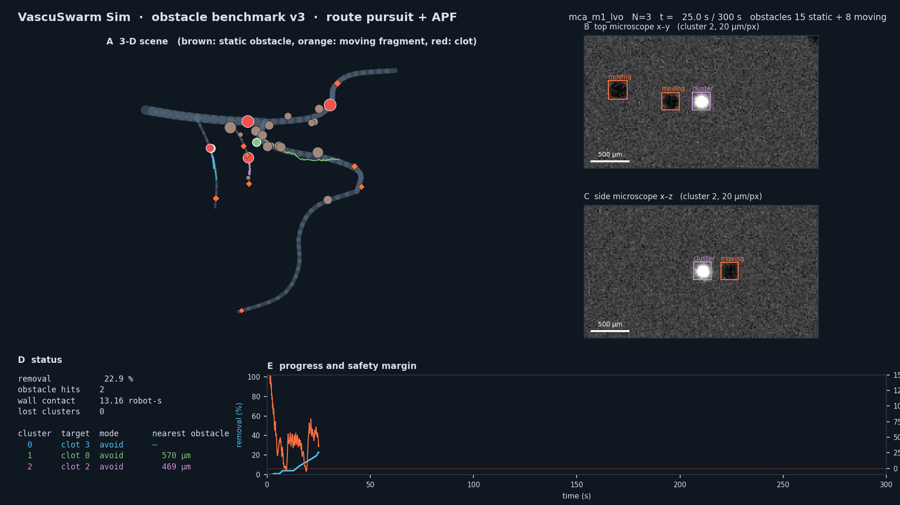
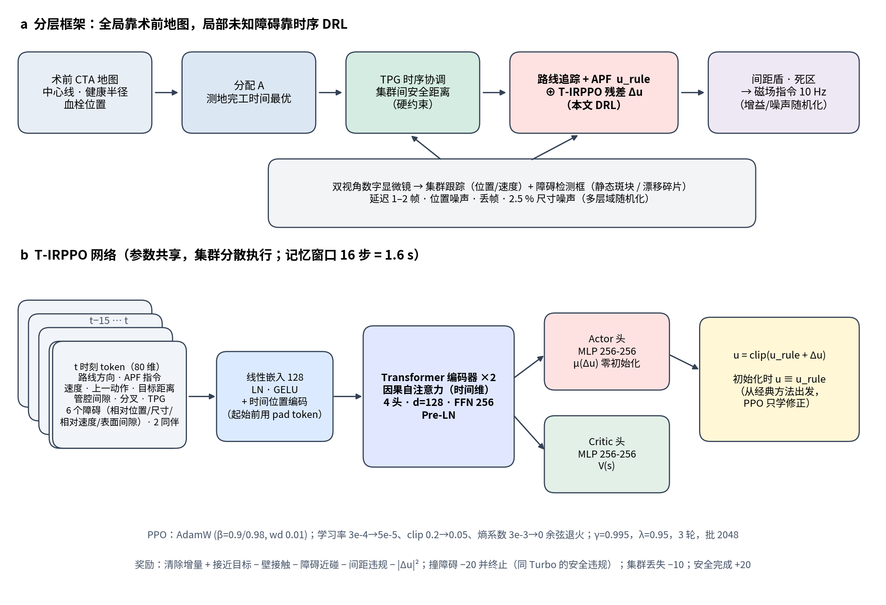

# 血管内多磁性微机器人集群取栓：时序 Transformer 残差强化学习（T-IRPPO）——论文初稿 v3

版本：2026-10-06。本稿取代 `MANUSCRIPT_DRAFT_20261006.md` 中的"碎屑"设定：障碍物改为与 An 等（2026，Turbo）一致的、
数字显微镜下清晰可见的静态 / 动态障碍。凡标注"【待填】"的数字在评估完成后由
`scripts/analyze_obstacles.py` 生成的 `research/validation/OBST_BENCH_20261006/SUMMARY.md` 填入，不手工改动。

---

## 摘要（草稿）

磁性微机器人集群有望在血管内直接溶解血栓，但要从体外走向可部署，必须同时解决三件事：
沿三维血管树到达多个病灶、多个集群之间保持安全距离、以及实时避开术前影像上没有的障碍
（附壁残余血栓、溶栓过程中脱落并随流漂移的栓子碎片）。我们提出一个只使用可部署信息
（术前 CTA 地图 + 数字显微镜成像）的分层框架：术前测地分配决定"谁去哪里"，时序计划图（TPG）
在时间维度上消解集群间冲突，而**时序 Transformer 残差强化学习（T-IRPPO）**在经典路线追踪 + 人工势场（APF）
之上学习局部修正，以处理地图之外的未知静态与动态障碍。策略的输入是检测框级别的观测序列
（对应 Turbo 的 YOLO 检测），通过因果自注意力利用最近 1.6 s 的历史；训练采用环境、感知、驱动三层域随机化。
在 14 种解剖、N = 1/2/3 个集群、每组 420 个配对场景上，T-IRPPO 的安全成功率【待填】，
相对调参后的 APF【待填】；消融显示时序建模、残差先验与域随机化各自的贡献【待填】。

---

## 1. 引言要点

1. 临床动机：大血管闭塞、肺栓塞、深静脉血栓；溶栓药物全身副作用；微机器人局部给药 / 机械辅助溶栓。
2. 从单机器人到集群、从二维到三维血管：两篇 NMI 工作（Medany 2025，超声驱动 + Dreamer；An 2026，磁集群 + Transformer PPO）
   都在平面通道或开放平面里导航，单集群。
3. 我们的问题设定：三维血管树、多病灶、多集群、静态 + 动态未知障碍、只有可部署信息。
4. 关键观察：
   - 全局路线有术前地图，不需要 RL 去"探索"（纯 RL 从零学习 Safe ≤ 0.7%，§7.6 旧稿）；
   - 集群间冲突来自三维欧氏距离、路线术前已知 → 时间维度排序（TPG）；
   - 真正需要学习的是**地图之外**的部分：未知障碍的局部避让，而 APF 在管腔里有"避障—贴壁"两难（§4.2）。
5. 贡献：
   - (i) 一个对齐真实部署信息的多集群取栓基准（union-of-tubes 管腔、可部署感知、Turbo 式障碍与域随机化、配对场景与预登记种子池）；
   - (ii) 分层框架：分配 A + TPG + T-IRPPO；
   - (iii) T-IRPPO：在经典控制器上做残差的时序 Transformer PPO，零初始化保证起点即经典方法；
   - (iv) 系统的对比与消融（无避障、APF、MLP/GRU/Transformer、有无规则先验、有无域随机化），以及注意力可解释性。

---

## 2. 仿真环境（benchmark v3）

### 2.1 血管与物理
- 14 种解剖的三维中心线树（脑、冠脉、肺、腹部、外周动静脉、静脉窦），管腔半径 0.3–13.5 mm；
- 集群半径 0.08 mm（可进入 0.3 mm 的分支），速度上限 1 mm/s，10 Hz 控制；
- 流场：分支水力网络，血栓随溶解改变局部半径并重算流场；
- 分叉处 union-of-tubes 管腔（纯几何，无隐藏状态）；
- 已移除旧版 20 µm 碎屑示踪粒子。

### 2.2 障碍物（`marl/obstacle_field.py`，对齐 Turbo Supplementary Table 4）

| 量 | Turbo（开放平面） | 本文（三维血管，按局部健康半径 R 缩放） |
|---|---|---|
| 数量 | U[12, 24] | U[12, 24] |
| 静态 : 动态 | U[0.1, 0.9] | U[0.1, 0.9] |
| 静态障碍 | 宽 1–3 mm 方/圆块 | 附壁球体（残余附壁血栓 / 斑块，术前地图未标注），半径 U[0.40, 0.70]·R，顶端可越过中心线，对侧通道 ≥ 0.88 R |
| 动态障碍 | 0.75–1.25 mm/s | 漂移栓子碎片，半径 U[0.08, 0.20] mm（≤ 0.35 R），沿血管 U[0.2, 0.8] mm/s 运动，分叉随机选支、末端反射 |
| 位置 | 随机 | 75% 在治疗路线所经的血管段（病灶附近的残余血栓与碎片），25% 按长度随机；离起点 ≥ 1.5 mm、离血栓 ≥ 1.0 mm |
| 碰撞 | 安全违规，终止 | 集群–障碍中心距 < 半径和即安全违规（训练中终止，评估中记为失败） |

为什么按 R 缩放：直接用 1–3 mm 的障碍会把 0.3–1 mm 的脑/冠脉分支完全堵死，任务不可行。

### 2.3 可部署感知
- 集群：成像位置估计（噪声、1–2 帧延迟、丢帧），或完整图像链（双视角渲染→检测→三维融合→跟踪，用于鲁棒性验证）；
- 障碍：YOLO 式检测框（Turbo 同款抽象）：集群 3 mm 视野内的障碍中心 + 尺寸，位置噪声 0.02 mm + 2.5% 尺寸，漏检 3%，
  与集群估计相同的延迟；**检测器不给身份和速度**，速度由相邻帧最近邻关联得到；
- 术前地图：中心线、健康半径、血栓位置（障碍不在地图上）。

### 2.4 Safe Success（主指标）
全部血栓清除、累计壁接触 < 1 robot-s、零障碍碰撞、零集群丢失、零集群间接触、间距合规（N > 1）。
另报原始完成率、清除率、T50/T90/T100、AUC、路径、撞障碍回合比例（静态/动态分开）、壁接触 ≥ 1 s 比例。

---

## 3. 方法

### 3.1 分配 A（术前）
术前地图测地距离上穷举最小化完工时间的血栓分配与访问顺序。

### 3.2 TPG 时序协调（术前 + 在线）
两条行程弧长平面上距离 < d_min + 0.6 mm 的连通域为冲突区；优先级调度给出每个冲突区的通过顺序（无环，无死锁）；
在线时后序集群在区前等待，直到前序集群的实测进度离开。TPG 的等待是硬约束，DRL 不能越过。

### 3.3 经典局部控制器：路线追踪 + APF（基线，也是 T-IRPPO 的先验）
纯追踪（前视 0.4 mm，分叉附近 0.1 mm）+ 最近接近点斥力（增益 10、作用距离 0.7 mm）+ 管壁向轴斥力
（v3.6：由术前地图的径向偏移给出，仅当距管壁 < 0.35 mm 时激活，见下）+ 运动障碍等待 + 死区。
APF 参数在训练解剖、独立调参种子上做网格搜索（27 组 × 54 回合），取 Safe 最高者：
增益越大撞障碍越少，但壁接触越多——**这是管腔内 APF 的固有两难**，也是引入学习的直接动机。
失败归因（调参后的 APF，1260 开发回合）：壁接触 ≥ 1 s 是主要失败（697 个失败回合中 535 个），
其中 485 个是避障诱发的——障碍斥力指向"障碍到集群"方向，对附壁障碍即指向管壁，纯追踪分量又持续沿
路线推进，集群被压在壁上数秒；同样场景关闭避障后壁接触 < 1 s。其余失败为纯超时（117，平均清除 54.5%）
与障碍碰撞（93）。为此 v3.6 给 APF 加了一个**只用术前地图的向轴势**：它只依赖传感器已匹配管段的
健康半径与径向偏移，不含任何特权信息，能把避障诱发的贴壁从表 X 的 44% 降到【待填】。

### 3.4 T-IRPPO
- **观测 token（83 维，世界坐标）**：路线方向、APF 指令、估计速度、上一动作、目标距离、管腔径向偏移比、壁间隙、
  是否近分叉、TPG 等待、剩余时间、径向偏移向量（指向管壁的方向）、6 个最近障碍（相对位置、尺寸、相对速度、表面间隙、掩码）、2 个同伴；
  与 Turbo 的状态 S19（目标距离/方位、自身框与速度、上一动作、n 个障碍的距离/方位/尺寸）逐项对应，并加上血管特有的地图量；
- **时序骨干**：16 步（1.6 s）记忆窗口，线性嵌入 128 + 可学习时间位置编码，2 层 Pre-LN Transformer 编码器（4 头、FFN 256），
  因果注意力；回合开始前的空位用可学习 pad token；取最新时刻输出；
- **Actor / Critic**：共享骨干、独立 MLP 头（同 Turbo）；Actor 输出层零初始化；
- **残差动作**：u = clip(u_rule + Δu)，初始化时 u ≡ u_rule；
- **PPO**：AdamW、余弦退火的学习率 / clip / 熵系数（同 Turbo 的训练设置，规模缩小）；
- **奖励**：清除增量、接近目标、壁接触、障碍近碰、间距、残差幅值；撞障碍 −20 并终止；丢失 −10；安全完成 +20；
- **多层域随机化**：环境（障碍数量/比例/尺寸/速度）、感知（定位噪声 0.02–0.08 mm、延迟 1–2 帧、丢帧 0–5%）、
  驱动（每集群指令增益 U[0.75, 1.25]、执行噪声 N(0, 0.025)）。
- **训练集**：只用 9 个训练解剖；N ∈ {1, 2, 3}；训练种子与评估种子池不相交。

### 3.5 一个记录在案的迭代（负结果，写进补充材料）
第一轮（v3.0）训练 100 分钟后，T-IRPPO 与 APF 打平（84 个配对回合：Safe 39.3 vs 40.5%），学到的残差几乎为零（|Δu| 中位 0.04）。
诊断：主要失败是壁接触（41–44% 的回合），而 v3.0 的 token 里没有"管壁在哪个方向"的信息，壁接触惩罚也偏弱；
大量样本是停在血栓上溶解、周围无障碍的无决策步骤。v3.1 加入径向偏移向量、提高壁接触与近碰权重、跳过无信息样本。

---

## 4. 实验设计

### 4.1 对比方法
| 方法 | 类别 | 说明 |
|---|---|---|
| 路线追踪（无避障） | 下界 | 只沿术前路线 |
| 路线追踪 + APF | 经典 | 调参后的人工势场 |
| Transformer PPO（无规则先验） | 学习（Turbo 式） | 同网络、直接输出指令 |
| T-IRPPO（本文） | 分层 + 时序 DRL | 3 个种子 |

### 4.2 消融
| 消融 | 回答的问题 |
|---|---|
| MLP 残差 PPO（只看当前帧） | 时序记忆有没有用 |
| GRU 残差 PPO | Transformer 是否优于循环网络 |
| 无规则先验（direct） | 残差结构是否必要 |
| 无域随机化 | 多层域随机化的贡献 |
| 图像链跟踪（评估时） | 从检测框级感知换成像素级感知是否稳健 |
| N = 1 / 2 / 3，留出解剖 | 规模与泛化 |

### 4.3 协议
开发集：14 解剖 × 30 场景 × N = 1/2/3（每方法每种子 1260 回合），场景在方法间配对；
统计：配对自举 95% CI（对场景重采样；学习方法先在种子间平均）；
测试集（2700000000 起的预登记池）只在定稿时评估一次。

---

## 5. 结果【待填】

- 表 1：主结果（`SUMMARY.md` 第一张表）；
- 表 2：相对 APF 的配对差值；
- 图 3：训练曲线（`figures/V3_20261006/v3_training_curves.png`）；
- 图 4：主结果柱状图（`v3_main_results.png`）；
- 图 5：避障—贴壁、 安全—效率权衡（`v3_tradeoffs.png`）；
- 图 6：注意力投影（`v3_attention.png`，对应 Turbo Fig. 6）；
- 图 7：GUI 时序截图（APF vs T-IRPPO 同一场景）。

---

## 6. 讨论要点（草稿）
- 为什么不端到端：全局导航有术前地图可用，学习的价值在地图之外；纯 RL 在相同信息下几乎学不会长时程任务；
- 残差 + 零初始化：安全的起点，可解释（修正量直接可视化）；
- 局限：仿真中障碍不改变流场、不物理阻挡；集群为刚体近似；尚无闭环体外导航实验
  （团队体外实验验证溶栓本身，可作为 sim-to-real 的下一步：用实验视频标注检测器，验证检测误差分布）；
- 不能说：临床可用、优于 Turbo（任务不同）、零碰撞。
