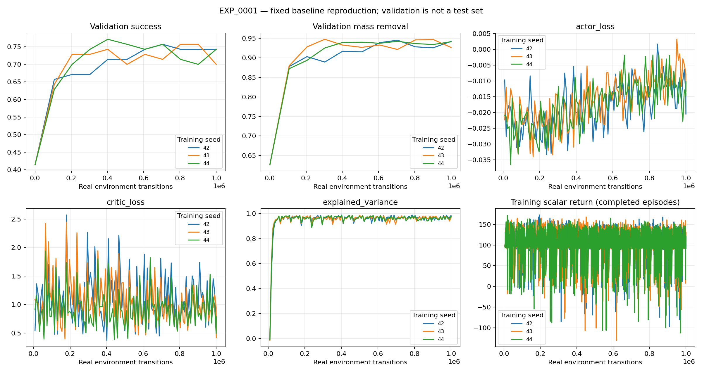
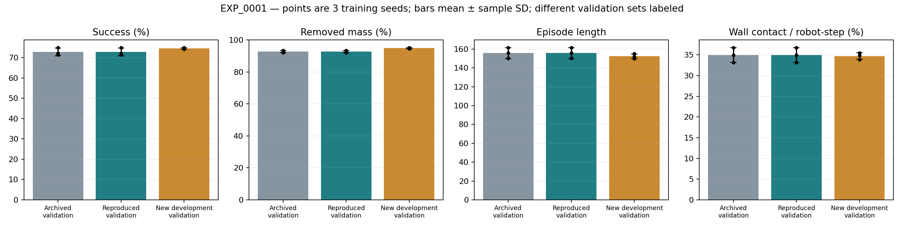
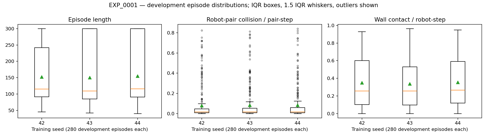
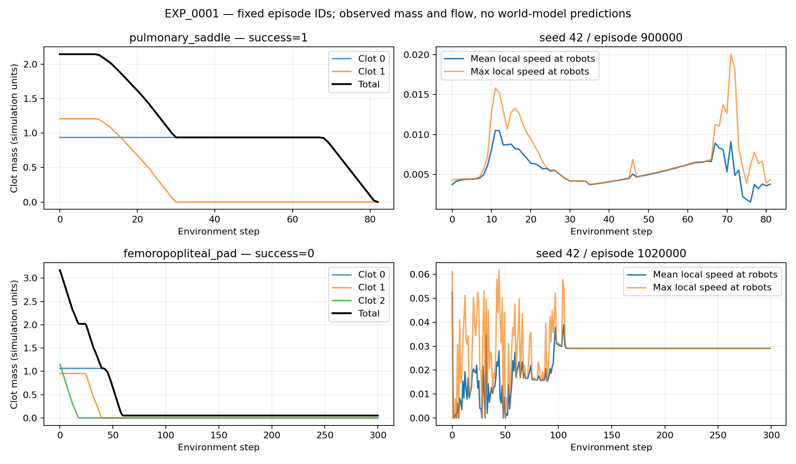
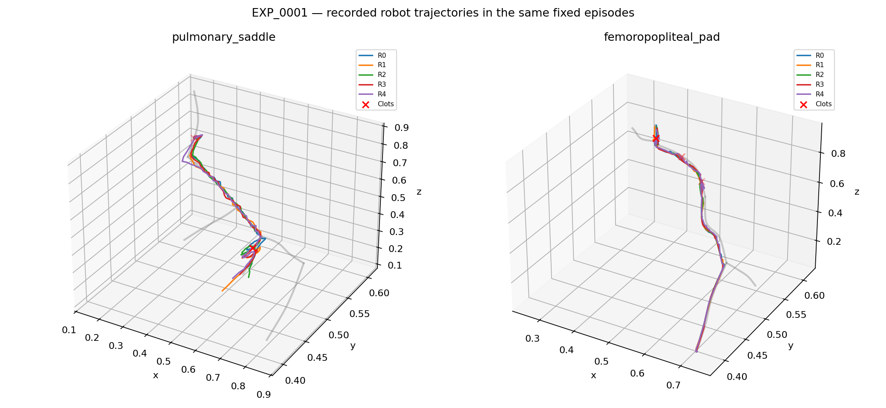

# EXP_0001 — Reproduce original current baseline

## Preregistration

| Field | Value |
|---|---|
| Experiment ID | EXP_0001 |
| Date | 2026-09-20 |
| Research Question | 当前完整源码能否在冻结依赖和配置下，从头复现现有geodesic_v基线？ |
| Hypothesis | HYPOTHESIS — NOT VERIFIED：3seed均值与原final validation相差不超过5个百分点，并可稳定运行/复算；此阈值是预登记工程验收容差，不是统计等效界限 |
| Parent Experiment | legacy `experiments/ladder_stage1/geodesic_v_seed{42,43,44}_*` |
| Git Commit | `8c159ab153e2f651a5cbdfa7c22706c86dc203d8`，来源HEAD `1dafc45` 加审计时工作树内容；独立branch `research/EXP_0001-baseline-reproduction` |
| Code Changes | 核心环境/算法零修改；新增research执行、provenance、只读诊断和报告工具 |
| Configuration | `configs/experiments/EXP_0001.json`，完整固定设置；原三seed config和summary副本归档 |
| Random Seeds | 正式42/43/44；smoke4242；原validation基数100000；额外development validation基数900000 |
| Training Steps | 每正式seed 1,000,000 transitions；smoke 16,384 transitions；无调参budget |
| Hardware | Intel Core Ultra 9 285K；125GiB RAM；2×RTX4090，每卡驱动报告49140MiB；正式前机器原始探测归档 |
| Environment Version | 当前dirty源码冻结snapshot + 环境文件SHA256；Python3.10.20/numpy1.26.4/torch2.3.0/gymnasium1.2.3 |
| Algorithm | GAT-MAPPO，V critic，dropout0，flow_guided residual0.2/speed0.65 |
| Observation Space | geometric36，5机器人邻接图，4×6血栓全局state |
| Action Space | 每机器人3D残差，经引导与局部坐标变换成为world action |
| Reward Function | 原milestone，coverage0.2，step_cost0，approach0.1，double_count on |
| World Model Configuration | disabled，无模型训练、无MVE、无MPC |
| Baseline | 原geodesic_v最终模型，三seed成功率72.8571%±1.8898%，清除92.7773% |
| Evaluation Metrics | 主：原final validation成功率/质量清除；次：长度、完成时间、wall/pair collision、return、首次接触、动作/流速/轨迹诊断、成本 |
| Expected Result | HYPOTHESIS — NOT VERIFIED：近似复现，无性能提升预设；固定后不因分数修改方案 |

## Protocol and gate

1. 审计和版本冻结，归档Python/pip/GPU/CPU及源码manifest；原工作树保持不变。
2. 在冻结源码中运行完整pytest，保存stdout/stderr/exit；短训练前通过相关环境/策略测试。
3. smoke单seed4242：14场景、64env、同网络/物理/奖励、16,384 transitions、5epochs；验证loss/gradient/参数/日志/checkpoint无NaN，至少发生更新，可载入并执行。
4. 正式42/43/44：两个GPU各至多一个进程，按固定顺序队列运行，各1M；原每100k验证/存盘，14×5训练validation、14×20最终validation；固定CPU亲和性排除6/7并单线程BLAS，沿用旧实验措施。
5. 三个最终checkpoint在900000起点的14×20回合进行额外development validation。配置显式继承；这不是封存test，不宣称unseen topology。记录原始逐回合和逐步诊断，不修改控制行为。
6. 核对最终280回合与summary；比较原3seed均值/标准差及配对差异。每个seed原样报告。
7. 验收：3训练完成，无非有限值，checkpoint加载/原始指标可复算；原协议平均success绝对差≤5pp。若未达则记录负结果，不扩大容差。性能容差不代表p值或统计等效。

正式实验开始后不修改执行源码。失败不删除；相同代码重试仅针对native signal并保留attempt，最多2次，配置/断言/NaN立即停止依赖工作。若修正科学代码，另开实验ID。

## Metric definitions

Success/Completion Rate：全部质量清零回合比例（同义，不另造指标）。Clot Removal：每回合1−remaining/initial，再按场景等权。Episode Length：全部回合步数；Complete Time：仅成功回合步数，失败不填0。Collision Rate：每步碰撞pair数/总机器人pair数；Wall Contact Rate：总robot-wall事件/(N×steps)。另外保留原始event总数。

首次接触将原零基索引转为转移步数+1；未接触为null。Energy为action L2及平方和代理，不是真实焦耳。Flow是模拟速度，unsafe阈值/剪切未定义时N/A。sample efficiency以固定真实转移预算和validation学习曲线报告，跨seed方差用ddof=1。

## Actual Result

# EXP_0001 Baseline reproduction report

Frozen code: `8c159ab153e2f651a5cbdfa7c22706c86dc203d8`.

结果由 scripts/research_report.py 从不可替换的原始记录计算；三训练种子，标准差ddof=1。
主比较是相同历史validation协议，额外development validation不是封存test，也不代表未见拓扑。

| 数据集/运行 | Success mean ± SD | Clot removal mean ± SD | Episode length mean ± SD | Wall contact/robot-step mean ± SD |
|---|---:|---:|---:|---:|
| archived_validation | 72.8571 ± 1.8898% | 92.7773 ± 0.6408% | 155.7952 ± 5.7866 | 34.9418 ± 1.8215% |
| reproduced_validation | 72.8571 ± 1.8898% | 92.7773 ± 0.6408% | 155.7952 ± 5.7866 | 34.9418 ± 1.8215% |
| development_validation | 74.6429 ± 0.3571% | 94.9299 ± 0.3601% | 152.3857 ± 2.4573 | 34.7250 ± 0.8269% |

## Per-seed results

| Seed | Archived success | Reproduced success | Development success | Reproduced removal | Train seconds |
|---|---:|---:|---:|---:|---:|
| 42 | 72.1429% | 72.1429% | 75.0000% | 92.2183% | 921.29 |
| 43 | 75.0000% | 75.0000% | 74.2857% | 93.4767% | 917.24 |
| 44 | 71.4286% | 71.4286% | 74.6429% | 92.6370% | 902.18 |

## Comparison with baseline

成功率绝对变化 +0.0000 pp，相对变化 +0.0000%；质量清除率变化 +0.0000 pp。
预登记±5pp工程复现容差：PASS。不以此宣称统计等效或显著提升。

## Diagnostics and costs

Completion Rate与Success Rate定义相同。成功回合完成步数 102.2316 ± 3.8157；有接触回合首次接触步数 8.4429 ± 0.4444。
Robot-robot collision / pair-step：8.1387 ± 0.1522%；每回合pair事件 213.5821 ± 3.5586。
Evaluation reward：87.7817 ± 0.6083；平均模拟flow speed：0.0141 ± 0.0004。
平均执行动作L2：0.7421 ± 0.0071；平方和仅为energy proxy。
完整载入策略接口CPU推理成本：0.6631 ± 0.0069 ms/step，包含critic和控制转换，不是纯actor延迟。
三次训练耗时总和 2740.71s；实际作业elapsed另见attempt JSON。并行运行，不能把总和当wall-clock。
历史三seed training_seconds总和2603.43s，本轮2740.71s，差+137.28s（+5.27%）。此为描述性成本对照；并发调度、梯度观察同步和系统负载未被单独控制，不能归因为算法变化。
GPU峰值allocated/reserved、validation曲线AUC及所有梯度norm见aggregate和health日志。观察梯度会产生额外同步成本，未作无观察器配对成本实验。
Sample Efficiency：固定各1M真实转移，逐seed validation AUC为描述性值；没有新算法对照，不能验证H1。

## Stability and limitations

全测试171 passed、1 skipped；先完成16,384-transition smoke。正式每seed的有限loss/梯度/参数、非零actor更新、checkpoint载入及280回合指标复算均通过才生成此报告。
完整性检查：冻结132文件hash未变，原目录审计时86个Python文件未变，原分支仍为github-clean。
冻结期间未改核心算法。只报告已完成seed，脚本要求全部预登记seed存在；失败attempt不删除。
Unexpected Finding：smoke checkpoint在同cuda:0设备重放14回合时success/steps/wall/removal全部精确一致；CPU重放success一致，但最大单回合清除率差2.9065pp。见FAILURE_LOG F003。主复现与CPU开发验证的设备差异必须保留，不能归因为算法。
工程失败：F001为coordinator缺少PYTHONPATH，训练已成功，修正启动路径后检查通过；F002为分析脚本预编译语法错误，未产生错误结果。原始记录均保留。
不同血管/机器人数量的最终泛化、unsafe flow阈值、shear、真实能耗与世界模型预测误差：N/A。未定义的物理量不补造。

## Paired checkpoint comparison

只读比较历史与本轮最终actor/critic张量；完整checkpoint还含不同运行状态，其文件hash可以不同。

- seed42：actor精确一致=True，critic精确一致=True；旧权重文件未变=True。
- seed43：actor精确一致=True，critic精确一致=True；旧权重文件未变=True。
- seed44：actor精确一致=True，critic精确一致=True；旧权重文件未变=True。

## Failure cases and observed behaviors

完整失败回合保存在evaluation/seed_*/episodes.jsonl；固定seed42的首个肺动脉与股腘动脉回合作为轨迹图，未按成功挑选。
质量与血流曲线支持对具体回合的描述，但不单凭总成功率推断协作或reward hacking机制。复杂场景逐类结果见summary.json。

## Scientific interpretation and innovation

What improved / worsened：上表定量差异仅表示复现差异，未改变算法，不能归因为方法改进。
What did not change：physics、observation、reward、actor/critic、控制器与正式训练预算。
Why：原协议的相同指标还得到actor/critic张量相等的直接支持；CPU/GPU轨迹分歧的具体浮点传播机制仍为HYPOTHESIS — NOT VERIFIED。
支持/削弱：此实验仅检验工程复现，不验证H1–H5。新的问题是严格评估划分、接触/安全诊断与旧world model语义。
Engineering Improvement：可追溯基线与仪表。Algorithmic Improvement：无。Scientific Contribution：描述性复现证据。Potential Novel Contribution：无新增主张。
NOVELTY CLAIM — NEEDS LITERATURE VERIFICATION。Literature verification required.

## Development validation by territory

每个场景60回合，汇总三个训练seed；按成功率排序仅用于展示全部场景，不选择模型。

| Territory | Success | Clot removal | Steps | Wall contact / robot-step | Pair collision / pair-step |
|---|---:|---:|---:|---:|---:|
| femoropopliteal_pad | 11.67% | 92.97% | 273.03 | 80.26% | 34.93% |
| coronary_rca | 25.00% | 89.04% | 248.77 | 74.51% | 34.70% |
| carotid_bifurcation | 45.00% | 89.20% | 197.77 | 49.04% | 3.71% |
| coronary_lm_bifurcation | 53.33% | 84.96% | 188.18 | 47.56% | 4.64% |
| mca_m1_lvo | 58.33% | 85.29% | 196.17 | 58.73% | 8.42% |
| renal_artery | 83.33% | 95.95% | 138.08 | 33.15% | 3.43% |
| sma_embolism | 85.00% | 96.79% | 126.55 | 39.22% | 8.02% |
| iliac_may_thurner | 93.33% | 96.03% | 128.00 | 8.41% | 2.00% |
| ica_siphon | 95.00% | 99.89% | 105.40 | 32.41% | 2.49% |
| basilar_vertebral | 96.67% | 99.12% | 105.08 | 18.01% | 1.39% |
| popliteal_calf_dvt | 98.33% | 99.80% | 118.38 | 25.04% | 2.33% |
| cerebral_venous_sinus | 100.00% | 100.00% | 112.53 | 4.56% | 0.94% |
| ica_terminus_t | 100.00% | 100.00% | 91.53 | 15.15% | 1.29% |
| pulmonary_saddle | 100.00% | 100.00% | 103.92 | 0.10% | 5.65% |

## Fixed episode observations

- seed42 / pulmonary_saddle / episode 900000：成功=1，长度82步，首次接触10步，清除率100.00%；最后至多50步新增清除占初始总质量43.68%；平均同时处理0.439个血栓，wall contact/robot-step=0.00%。
- seed42 / femoropopliteal_pad / episode 1020000：成功=0，长度300步，首次接触1步，清除率98.37%；最后至多50步新增清除占初始总质量0.00%；平均同时处理0.177个血栓，wall contact/robot-step=87.13%。

这些是固定回合的观测，不构成对全部失败原因的因果证明；逐血栓残余与活动机器人见fixed_episode_cases.json。
流速曲线采样在各机器人位置，变化同时受机器人移动及局部阻塞影响，不能单凭这条曲线宣称全血管流量恢复。
股腘动脉低成功率及固定回合消融停滞登记为FAILURE_LOG F004；后续需分别验证局部可控性、分配、接触和投影机制，不先调参掩盖。

## Figures and provenance

机器、pip freeze、代码manifest、原参考文件副本：`research/runs/EXP_0001/provenance/`。
聚合及所有原始产物SHA256：`research/runs/EXP_0001/analysis/`。

下一实验：EXP_0002评估协议验证；本轮不启动世界模型创新训练。

## Conclusion

工程基线复现通过。
