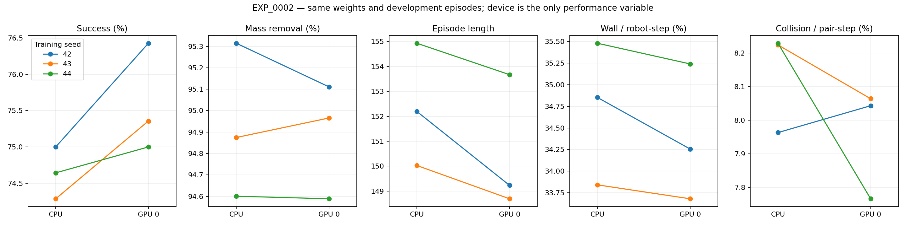
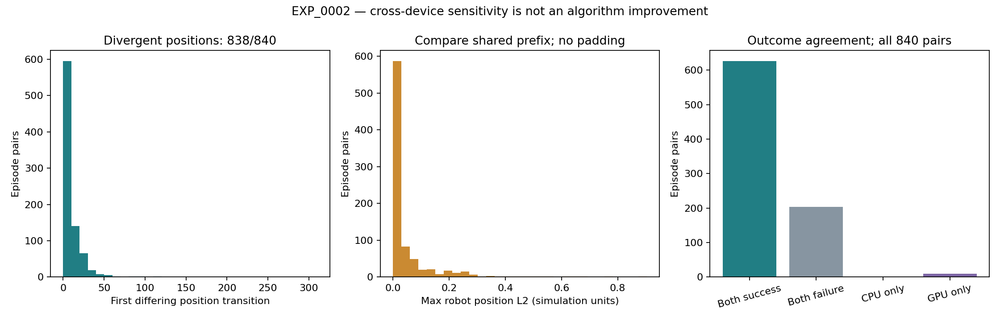
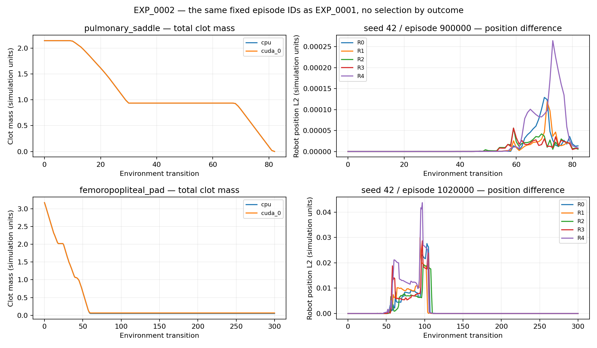

# EXP_0002 — Verify evaluation protocol and device sensitivity

## Preregistration — before implementation and execution

| Field | Value |
|---|---|
| Experiment ID | EXP_0002 |
| Date | 2026-09-20 |
| Research Question | 固定权重和episode时，评估接口是否可靠复现，CPU/GPU设备差异会改变多少结果？未来geometry划分能否明确防止内容重叠？ |
| Hypothesis | HYPOTHESIS — NOT VERIFIED：同设备重复和历史接口一致；跨设备可能产生轨迹分歧，影响大小未知 |
| Parent Experiment | EXP_0001 |
| Git Commit | `c7830951f2674aa7899b25da2ff0d49d8e81d8ef`，branch `research/EXP_0002-evaluation-protocol`；143文件hash与54个父实验输入文件hash记录于runs/EXP_0002/provenance/ |
| Code Changes | 新增只读协议检查、完整geometry内容hash、配对设备实验、未来split清单与报告；不改环境、策略或EXP_0001执行代码 |
| Configuration | configs/experiments/EXP_0002.json；各seed继承EXP_0001原始config并校验hash |
| Random Seeds | 权重42/43/44；主评估900000+scenario_index×10000+0..19；旧协议控制100000+scenario_index×10000 |
| Training Steps | 0；复用三个各训练1M的final checkpoint，不重新训练或选择best checkpoint |
| Hardware | 同一机器；CPU和cuda:0配对；历史控制按原训练设备cuda:0/cuda:1；单线程BLAS |
| Environment Version | EXP_0001冻结环境，SHA256核对；依赖与硬件另存provenance |
| Algorithm | 原GAT-MAPPO V critic + flow_guided，deterministic mean actions |
| Observation Space | geometric36，5机器人邻接图，4×6血栓state |
| Action Space | 每机器人3D残差，经原引导与坐标转换执行 |
| Reward Function | 原milestone，coverage0.2、step_cost0、approach0.1、double_count on |
| World Model Configuration | disabled，N/A |
| Baseline | EXP_0001的同权重CPU开发验证；成功74.6429%±0.3571pp、清除94.9299%±0.3601pp |
| Evaluation Metrics | 成功/清除/长度/wall/pair collision及其逐seed配对差；成功翻转数、首次动作/状态分歧、轨迹最大误差、同设备重复一致性、接口复现一致性；成本按设备记录 |
| Expected Result | HYPOTHESIS — NOT VERIFIED：同设备可复现；不预设GPU更好，不设性能提升目标 |

## Single main variable and controls

唯一性能比较变量为推理设备cpu vs cuda:0；权重、环境、奖励、初始状态、episode seeds、确定性动作和指标不变。配置校验、内容hash和未来split是协议正确性检查，不同时改变受测策略。CPU和GPU各840回合，合计1680；每seed/device额外重复每场景首回合，共84回合。smoke使用seed42每场景1回合、两设备及重复，共56回合。历史接口控制3seed×14回合，42回合。正式预算不根据中途性能调整。

同设备重复要求轨迹数组精确相等；CPU主评估与EXP_0001同回合的非时间指标及轨迹数组精确一致；历史控制success/steps/wall完全相等、removal差≤1e-7。cross-device差异本身不是gate失败，必须完整报告。各seed单独报告，mean±sample SD以训练seed为统计单位，不把840相关回合当840独立训练。

新协议记录完整初始状态与geometry hash。geometry hash包含points/radii/branch ids、分支连接与flow_fraction、station_graph，不沿用仅有点/半径的hash作为完整物理身份。单位测试应证明相同数组但不同连接/流量份额会被区分。

## Split audit and sealed prospective test

检查旧validation与final-validation的episode重叠；从全部已保存EXP_0001 checkpoint恢复可见训练树，统计覆盖的generation。未保存的训练树不推测、不声称已排除泄漏。

为未来实验登记same_family_geometry_v1：14类×40训练实例、×10验证实例、×20测试实例。只reset并记录geometry/初始状态hash，不在新test运行policy、收集reward或按分数筛选。重复内容直接报错并保留，不重抽掩盖。这个集合尚未被训练器消费，不等于历史训练已采用严格split；同类不同geometry也不等于未见拓扑。未来训练必须显式遵守清单及generation fence，EXP_0005再研究拓扑外推。

## Research gate

先冻结源码和配置，再运行相关环境/控制/协议回归测试；通过后smoke；通过后正式设备配对、历史控制和split审计。任一正确性断言失败停止依赖步骤，保存attempt，无自动重试。代码修正若发生在正式实验期间，另开experiment ID。跨设备结果差异和历史数据覆盖不足如实报告；不能因此修改阈值。

未来统一设备预先固定为cuda:0，不根据本轮哪个设备分数高再决定。数据集只允许称为future prospective split，不把未见历史训练树的缺失证据当作不重叠证据。

## Actual Result

# EXP_0002 — Evaluation protocol report

执行版本：`c7830951f2674aa7899b25da2ff0d49d8e81d8ef`。分析脚本hash：`d33ca8569fba99dbb5f328879d9d6ab230aa66def0b2379f0b83ba4a824a3566`。

本轮不训练，复用EXP_0001全部三个最终权重。唯一性能变量是CPU vs cuda:0；同一840回合配对，另做84次同设备重复。均值±样本标准差来自3个训练seed，不能把840回合解释为840独立模型。
开发验证，不是封存test；GPU未来统一设备在看到结果前已固定。

| Device | Success | Mass removal | Episode length | Wall / robot-step | Collision / pair-step |
|---|---:|---:|---:|---:|---:|
| cpu | 74.6429 ± 0.3571% | 94.9299 ± 0.3601% | 152.3857 ± 2.4573 | 34.7250 ± 0.8269% | 8.1387 ± 0.1522% |
| cuda:0 | 75.5952 ± 0.7435% | 94.8884 ± 0.2695% | 150.5321 ± 2.7320 | 34.3926 ± 0.7891% | 7.9576 ± 0.1663% |

## Per-seed paired results

| Seed | CPU success | GPU success | GPU−CPU success (pp) | CPU removal | GPU removal |
|---|---:|---:|---:|---:|---:|---:|
| 42 | 75.0000% | 76.4286% | +1.4286 | 95.3144% | 95.1109% |
| 43 | 74.2857% | 75.3571% | +1.0714 | 94.8745% | 94.9657% |
| 44 | 74.6429% | 75.0000% | +0.3571 | 94.6006% | 94.5887% |

## Actual result and comparison

成功率GPU−CPU=+0.9524pp，相对+1.2759%；清除率差-0.0414pp；长度差-1.8536步；wall差-0.3324pp；pair collision差-0.1811pp。
这些是测量设备效应，不称Algorithmic Improvement或临床差异。CPU与父实验同回合的非时间指标和全部trace数组精确一致，基线差0。
成功结局翻转10/840：仅CPU成功1，仅GPU成功9；跨设备全部trace数组精确一致0/840。
相同初始状态下首次执行动作的最大绝对差2.38418579e-07；共同时间前缀内最大机器人位置L2差0.903776646（模拟单位）。不补齐已结束轨迹，不把不同长度直接作整段相减。
首次动作已出现差异能定位到policy/控制计算链的设备影响；尚未定位具体浮点算子或证明哪种设备更接近物理真值。放大机制仍为HYPOTHESIS — NOT VERIFIED。

## Correctness, stability and costs

完整回归177 passed、1 skipped。56回合smoke通过；正式CPU父实验840回合一致；84对同设备重复精确一致；42个历史GPU控制回合与旧接口的success/steps/wall一致且removal差≤1e-7。没有训练、梯度更新或checkpoint选择。
CPU完整策略接口推理：0.6668 ± 0.0032ms/step；GPU：1.0964 ± 0.0025ms/step。包含critic/动作转换与传输，在并发执行下测得，不是纯actor或受控硬件benchmark。
正式任务作业耗时总和CPU=254.29s、GPU=308.27s，包含载入/重复/trace记录，不等于并行总wall-clock。
Training Stability、Training Cost、Sample Efficiency改善：N/A（Training Steps=0）。Completion Rate=Success Rate；任务质量/碰撞定义沿用EXP_0001；未引入新的unsafe流速阈值或物理单位。

## Split audit

内容hash包含点、半径、分支、连接、flow_fraction和派生几何数组；它检查精确有序内容身份，不是图同构或近似重复检测。初始状态另包含机器人/血栓/RNG身份。
未来train/validation/test分别560/140/280个实例；各split内部及三者之间内容hash无重复。封存test策略执行数0。
该清单是供后续训练消费的prospective split；尚未接入训练器，不可宣称旧策略没有训练泄漏。所有集合来自相同14类场景，不是unseen-topology test。
历史评估与选择验证的复用：{"42": {"selection_validation_episodes": 70, "final_validation_episodes": 280, "overlapping_episodes": 70, "overlap_fraction_of_final": 0.25}, "43": {"selection_validation_episodes": 70, "final_validation_episodes": 280, "overlapping_episodes": 70, "overlap_fraction_of_final": 0.25}, "44": {"selection_validation_episodes": 70, "final_validation_episodes": 280, "overlapping_episodes": 70, "overlap_fraction_of_final": 0.25}}。
已保存训练树共462条记录、420个独立完整hash；checkpoint无法提供完整训练历史。
实际generation从1开始。原清单的missing_generations_through_last_saved按0..max列举，包含不存在的generation0；本报告仅由observed_generations按1..max重新计算实际树覆盖。保留原始字段，不静默改写。
该分母为创建过的树generation数量，可能包含初始化后重置、未用于采样的树，不能直接解释为全部实际训练转移覆盖。

- seed42：已保存的子环境generation 140/266，未覆盖126；不足以认证历史训练与评估完整互斥。
- seed43：已保存的子环境generation 140/266，未覆盖126；不足以认证历史训练与评估完整互斥。
- seed44：已保存的子环境generation 140/266，未覆盖126；不足以认证历史训练与评估完整互斥。

全部集合的交集计数如下；saved_historical_train仅代表有保存证据的子集。

| Pair | Identical content hashes |
|---|---:|
| train__validation | 0 |
| train__test | 0 |
| train__saved_historical_train | 0 |
| train__legacy_final | 0 |
| train__development | 0 |
| validation__test | 0 |
| validation__saved_historical_train | 0 |
| validation__legacy_final | 0 |
| validation__development | 0 |
| test__saved_historical_train | 0 |
| test__legacy_final | 0 |
| test__development | 0 |
| saved_historical_train__legacy_final | 0 |
| saved_historical_train__development | 0 |
| legacy_final__development | 0 |

## All outcome flip cases

全部10个翻转回合均列出；1表示全部血栓清零。

| Training seed | Scenario | Episode seed | CPU success | GPU success | GPU−CPU removal (pp) |
|---|---|---:|---:|---:|---:|
| 42 | coronary_rca | 920014 | 0 | 1 | +0.4675 |
| 42 | ica_siphon | 960001 | 0 | 1 | +0.0700 |
| 42 | carotid_bifurcation | 980000 | 0 | 1 | +0.4013 |
| 42 | carotid_bifurcation | 980002 | 0 | 1 | +1.3204 |
| 43 | coronary_rca | 920010 | 0 | 1 | +0.3165 |
| 43 | popliteal_calf_dvt | 940006 | 0 | 1 | +12.1657 |
| 43 | basilar_vertebral | 990019 | 0 | 1 | +21.4276 |
| 44 | mca_m1_lvo | 950016 | 1 | 0 | -13.3225 |
| 44 | ica_siphon | 960009 | 0 | 1 | +0.9009 |
| 44 | sma_embolism | 1010014 | 0 | 1 | +1.1258 |

## Failure cases, observed behaviors and interpretation

全部失败与翻转回合在paired_episodes.csv和各设备episodes.jsonl；没有按成功挑选或重跑。轨迹图沿用EXP_0001预固定的肺动脉与股腘动脉两个episode ID。
What improved：测量来源、设备、配置、身份和未来划分现在可审计。Why：同设备和父接口控制提供直接证据。
What worsened：新增检查和trace记录有执行成本；设备间性能指标的变化见上表，不能概括为统一改善。
What did not change：权重、物理、奖励、观测、动作变换和开发验证回合。
Hypothesis support：通过同设备/接口复现检查；跨设备是否精确一致由翻转与轨迹计数判断。H1–H5未测试。
New question：如何定位最早浮点分歧及其接触/投影敏感性，怎样在未来训练中强制消费split清单？这些应独立实验，不在此轮改数值物理。
Engineering Improvement：协议检查与数据身份。Algorithmic Improvement：无。Scientific Contribution：本机固定模拟器下的设备敏感性证据。Potential Novel Contribution：无。Needs Literature Verification：I1–I7。
NOVELTY CLAIM — NEEDS LITERATURE VERIFICATION。Literature verification required.

## Figures and reproducibility

原始数据、attempt、协议、snapshot、硬件依赖、父输入hash与split清单：`research/runs/EXP_0002/`。
分析入口：`scripts/research_protocol_report.py`；结果版本独立归档。未来测试清单未获得性能分数。

## Conclusion and next experiment

EXP_0002协议gate通过；不认证历史完整训练划分或跨设备等价。允许EXP_0003完善科研指标及准备未来split消费接口，不直接进入世界模型规划。
