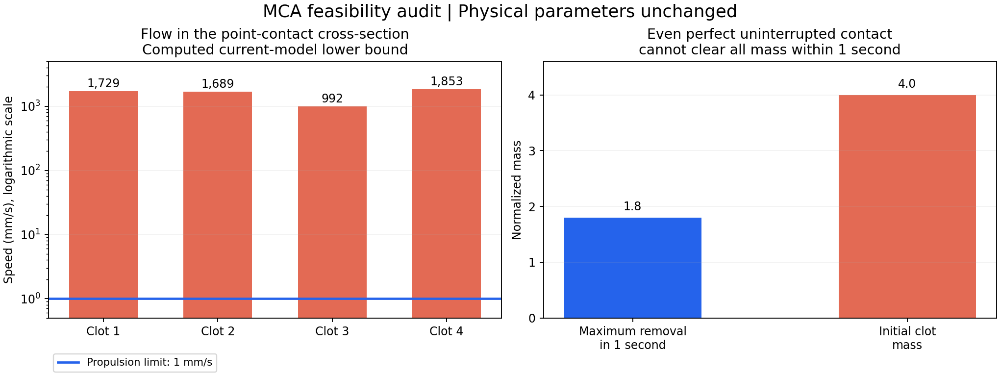

# EXP25 继续修正：血流实现与接触模型核查

2026-09-30。用户要求继续后，保留现有血流、推进速度、分散初始化和全部清零标准开展核查。未将“继续”解释为允许通过降低原任务难度兑现80%。

## 结果

独立组装 Kirchhoff 节点压力方程，用稀疏线性求解器求流量，避免重复使用生产代码的递归树求解。21组健康、全局部分溶解和单栓部分溶解工况全部通过；与参考求解的最大相对误差 4.53e-13，与编译版也一致。未发现把mL/min转换为mm³/s时重复乘60/1000、截面积换算或求压错误。

146 mL/min 是健康入口的校准值；当前四处阻塞之后，实际求解入口约 50.963 mL/min，并非强制146通过狭窄。局部截面变小仍会产生高速流。把分段半径梯形阻力换为线性锥管解析积分作独立诊断，最大入口流量差约 4.86%；这个差值不能解释推进与血流之间约千倍的差距，生产积分未被此次诊断修改。

## 接触定义存在的建模缺口

当前血栓质量影响局部管腔半径，但溶解“接触”是机器人中心到中心线点靶的距离≤0.12mm，同时满足沿血管距离≤0.12mm。它不是血栓实体表面、附着或驻留模型。机器人半径0.08mm。

| 栓点 | 局部剩余管腔半径mm | 栓点截面内可计为接触的最低流速mm/s | 接触时机器人表面离管壁的最小间隙mm |
|---:|---:|---:|---:|
| 1 | 0.497 | 1728.6 | 0.297 |
| 2 | 0.476 | 1688.8 | 0.276 |
| 3 | 0.368 | 992.2 | 0.168 |
| 4 | 0.351 | 1853.4 | 0.151 |

这些是当前圆管降阶模型在栓点中心截面内的计算，不是患者/设备实测，也不是整个三维接触球上的全局最优控制证明。此前430–849mm/s是最贴壁位置的乐观流速；可计为点靶接触的位置更靠近中心线，所以这里是992–1853mm/s。两组值含义不同。

1mm/s来自另一篇论文训练域随机化的群体速度范围上端，不是本系统在血液中的已测极限；已核对归档补充材料Table4。原尺寸MCA健康流量与该推进速度、点靶接触同时使用，并不能自动组成可用的溶栓实验模型。

## 已修代码与验证

- 补齐参考单环境、编译单环境、并行训练与正式启动器的质量—时间检查，避免换入口绕过先前只接入并行入口的门禁。
- 显式工程基线覆盖选项仍可用，覆盖时manifest也记录不可达结论，不改变成功定义或默默忽略失败。
- 92项定向回归通过，含全部入口在创建运行目录之前拒绝已证实不可达任务的检查。
- 新增 `scripts/audit_mca_hydraulics.py`，报告与源文件hash保存在本目录。
- 增加 `feasibility.png/.svg` 解释流速/推进能力和总质量/时限的差距，并接入本地监控页。

## 当前训练状态与下一步边界

EXP24仍保持已保存的暂停检查点：61952 / 56064 / 55296步。成功率未达到80%，本轮未重启原工况长跑。旧76.9%为14场景平均，旧MCA单项56.7%，两者不能混为当前MCA历史成绩。

接下来真正需要补的是目标实验定义与执行器、血栓表面/接触驻留模型：离体泵控装置应使用实际泵流量、推进能力和作用时间；若坚持当前原尺寸MCA血流与1mm/s自由游动，则需有证据支持的附着/驻留或其他执行器机制。只有延长训练、延长时限、改变初始坐标都不能据此宣称全清可达。未擅自加入自动黏附、增强推进力或削弱血流。

