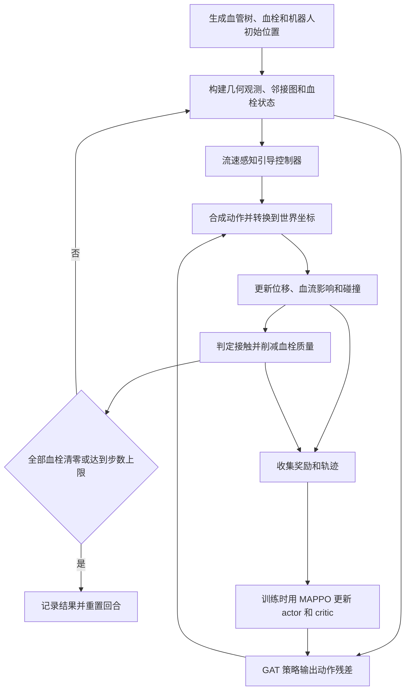

接下来# 项目工作原理与当前最佳溶栓方法分析

分析日期：2026-09-20。分析对象为本机 `/home/wj/桌面/vascular_marl_local.tar.` 目录中的当前源码和已保存实验，而不是旁边的旧版 `.tar.gz` 压缩包。本文读取了现有配置、日志和评估记录，未重新训练或重新运行策略评估。

## 1. 先给结论

这个项目研究的是：**让多个可独立控制的微型机器人，在三维分叉血管中找到血栓，并通过持续近距离接触，把模拟血栓的质量逐步清零。** 核心难点是选对血管分支、对抗血流、维持有效接触，以及协调多个机器人。

目前最有结果支持的方法路线是 **流速感知引导控制器 + GAT-MAPPO 有界残差策略**，代码中的名称为 `architecture="gat"`、`control_mode="flow_guided"`。引导控制器负责基本的路由跟随、血流补偿和横向位置选择；强化学习负责在这个基础上调整动作。

“效果最好”需要明确比较口径：

| 判断口径 | 当前结果 | 含义 |
|---|---|---|
| 现存四组实验，按三个训练种子的最终验证成功率均值 | `euclidean_v`，**73.33%** | 使用欧氏距离接触判定、V 型 critic |
| 同一批实验，按最终验证质量清除率均值 | `geodesic_v`，**92.78%**；成功率 **72.86%** | 使用更严格的沿血管路径接触判定、V 型 critic |
| 现存最终模型中，单个训练种子的最终验证成功率 | `geodesic_v` 的 seed43，**75.00%**；质量清除率 **93.48%** | 是单次训练的验证成绩，不能替代三种子平均或独立测试 |
| 历史文档报告的独立测试 | `flow_guided` 三种子成功率 **70.83% ± 2.18%**、质量清除率 **93.11%** | 见 `SUCCESS_STUDY.md`；对应原始测试目录和推荐权重未在当前副本中找到 |

因此，如果介绍项目当前的主方法，可以称为“**流速感知残差 GAT-MAPPO 协同接触溶栓**”。如果选择后续研究基线，我更倾向 `geodesic_v`：它的接触条件更符合血管路径约束，当前清除率也较高。这是基于建模合理性和现有结果的选择建议，尚不能宣称它在所有指标上优于 `euclidean_v`。

还有一个必须说清的事实：**当前代码实现的是接触驱动的质量削减模型，没有模拟钻削、旋转切割、超声碎栓或药物反应扩散。** “血栓破除”在本项目里具体表现为剩余质量下降，直至清零。

## 2. 整个项目是怎么运转的

### 2.1 从环境到动作，再到学习



其中，运行策略时需要 actor 产生动作；critic 用于训练中的价值估计，不负责实际驱动机器人。现有统一推理接口也会计算 critic 输出，但执行动作由 actor 与引导控制器决定。

### 2.2 各部分分工

| 部分 | 主要文件 | 实际作用 |
|---|---|---|
| 血管几何与路由 | [vessel_geometry.py](environments/vessel_geometry.py)、[vessel_anatomy.py](environments/vessel_anatomy.py) | 定义分支拓扑、中心线、半径、局部坐标系、解剖场景和沿血管最短路径 |
| 单环境仿真 | [vascular_3d_marl_env.py](environments/vascular_3d_marl_env.py) | 更新机器人运动、碰撞、血流、血栓质量、观测和奖励 |
| 批量训练环境 | [vector_env.py](environments/vector_env.py)、[balanced_vector_env.py](environments/balanced_vector_env.py) | 同时推进多回合，并让各解剖场景持续参与训练 |
| 引导与动作转换 | [geometric_control.py](marl/geometric_control.py) | 生成基础控制指令、叠加学习残差、完成局部坐标到世界坐标的转换 |
| 多智能体学习 | [mappo_advanced.py](marl/mappo_advanced.py)、[gat_policy.py](marl/gat_policy.py) | 用图注意力处理机器人之间的信息，使用 MAPPO 更新策略 |
| 当前训练主入口 | [train_vector_mappo.py](scripts/train_vector_mappo.py) | 组织采样、更新、验证、模型保存和实验统计 |
| 对照实验组织 | [auto_research_ladder.py](scripts/auto_research_ladder.py) | 分阶段比较接触判定、critic、观测和奖励设计 |
| 展示与载入 | [policy_loader.py](marl/policy_loader.py)、[watch_gui.py](watch_gui.py)、[make_gif.py](make_gif.py) | 还原不同策略结构，播放或导出仿真过程 |

训练动力学主要由 NumPy 实现，神经网络使用 PyTorch。PyBullet 主要承担可视化；这里没有使用完整流体求解器实时求解血液流动。

项目中还存在 MADDPG、Transformer、分层分配器和世界模型等研究模块。不过，当前 `ladder_stage1` 的 12 次实验全部采用 GAT、`flow_guided` 和 36 维几何观测，配置中没有启用世界模型或课程学习。不能把仓库里存在的全部模块都当成当前最佳策略正在使用的组成部分。

## 3. 机器人看到了什么，又能控制什么

### 3.1 环境和任务

当前这批实验的主要设置是：

| 项目 | 设置 |
|---|---|
| 机器人数量 | 5 |
| 名义血栓数量 | 3；具体回合数量由采样和场景可用位置决定 |
| 每回合上限 | 300 步 |
| 场景 | 14 类解剖场景，包括脑动脉、冠状动脉、肺动脉和下肢血管等 |
| 训练环境数 | 64，按解剖场景分组分配 |
| 每次训练预算 | 1,000,000 条环境转移，合计所有并行环境 |
| 机器人半径 | 0.0011，模拟坐标单位 |
| 动作 | 每个机器人各自输出三维连续向量 |
| 观测 | 每个机器人 36 维几何特征，另有机器人邻接图和供 critic 使用的血栓状态 |

血管由预设拓扑和参数化几何生成，并加入变化。项目支持解剖类别，但这并不等同于直接读取患者影像得到的个体血管模型。

### 3.2 几何观测为什么重要

36 维观测并不只是“机器人到血栓的方向”。它还提供沿血管应该怎么走、哪里有墙、当前位置的血流怎样等信息。

以下索引使用 Python 从零开始、左闭右开的切片写法：

| 观测位置 | 内容 | 对控制的意义 |
|---|---|---|
| `0:3` | 世界坐标位置 | 提供整体位置背景 |
| `3:6` | 局部坐标中的速度 | 判断运动状态 |
| `6:15` | 沿目标路由的三个前视点 | 在弯曲和分叉位置提前知道应该向哪里走 |
| `15:18` | 管壁外法向 | 知道管壁在哪个方向 |
| `18:21` | 径向余量、管腔半径、阻塞后的半径比例 | 判断可用空间及局部阻塞 |
| `21:25` | 局部血流和近壁推进衰减系数 | 判断顺流、逆流和可用推进能力 |
| `25:32` | 目标血栓相对位移、测地距离、欧氏距离、接触标志、质量比例 | 判断如何接近目标、是否开始溶解、还剩多少 |
| `32:36` | 最近机器人相对位置和距离 | 为协调和避碰提供信息 |

方向特征大多使用血管局部 Frenet 坐标表达，可以理解为“沿血管方向 + 两个横向方向”。这样，同一种控制规律可以迁移到不同朝向的血管段。

需要注意，前视点和目标信息是环境根据已知血管图、已知血栓位置计算后提供的。因此，项目当前解决的是在这些信息可用条件下的导航控制，还没有把医学影像定位、目标检测和地图重建一起解决。

### 3.3 动作怎样变成运动

环境将每个机器人的动作限制在允许范围内，再近似按以下关系更新位置：

```text
下一步位置 = 当前的位置
           + 受近壁阻力影响的主动推进
           + 血流造成的漂移
           + 随机扰动
           + 机器人重叠时的分离修正
```

随后执行血管内投影，处理撞壁和速度修正。主动推进最大标度为 `max_speed=0.018`；近壁时推进会衰减，最低系数为 `0.35`。

动作空间没有“给药量”“钻头转速”“切割力”或“超声功率”。每个机器人可以独立运动，也没有共用一个外部磁场时的驱动耦合约束。这决定了目前学习到的是理想化独立驱动条件下的协同运动策略。

## 4. 当前最强方法具体怎么完成溶栓

### 4.1 为机器人提供目标和沿血管路线

环境默认通过 `_assigned_clot()` 为每个机器人选择沿血管距离最近、尚未清除的血栓。`VesselTree.route_to()` 使用 Dijkstra 路径计算，提供距离场和下一跳；观测里的三个前视点沿这条路线生成。

例如，血栓与机器人分处相邻的两条分支时，正确路线可能要先返回分叉口，再进入目标分支。直接朝血栓的直线方向走，可能只会撞墙。

这一步已经包含显式几何规划。神经网络接收到的不是完全未经处理的原始空间信息。

### 4.2 流速感知控制器选择更可控的运动位置

`flow_guidance()` 同时处理两个问题：沿路线前进，以及在血流中保有控制能力。

它先读取局部管腔半径、阻塞比例、径向位置和血流观测，用近似抛物线流速剖面估计中心流速。血管中心往往流得更快，适当向横向偏移可以降低局部血流，从而更容易靠近目标或维持接触。

代码中的横向偏移量近似为：

```text
offset = R_eff × sqrt(max(1 - 0.35 × max_speed / u_center, 0))
```

其中 `R_eff` 是阻塞影响后的有效流动半径，`u_center` 是估计的中心流速。偏移还会受到几何半径和留壁余量的限制。

这个设计表达的控制意图是：**在能够到达目标的前提下，寻找血流较弱、又有一定活动空间的位置。** 它是启发式控制律，不能保证所有狭窄或分叉处都能成功避壁。

远离血栓时，引导方向主要来自第一个路由前视点；进入目标接触范围后，会改用血栓相对位移，再叠加横向偏移。这样，机器人从“赶路”转入“围绕血栓维持有效位置”的控制状态。

### 4.3 主动补偿血流，并考虑近壁推进衰减

引导动作近似为：

```text
基础动作 = (期望运动速度 - 观测血流速度) / 近壁推进系数
```

计算在归一化局部坐标中进行，之后限幅。这里的“减去血流”很关键：机器人想停留在血栓附近时，往往仍需输出主动推进来抵消流动。

当前 `guidance_speed=0.65` 用于限制基础期望速度的标度，不代表实际运动速度始终等于最大速度的 65%；血流、扰动、阻力和碰撞都会影响实际位移。

### 4.4 GAT-MAPPO 学习小幅修正

GAT 将机器人作为图节点，根据邻接关系聚合信息。当前环境按机器人间距离构图，邻接半径为 `0.06`，并保留自连接。各机器人通过图注意力获得邻近机器人信息，再输出三维连续动作残差。

最终动作在局部坐标中组合：

```text
局部动作 = 限幅并限制长度(流速感知引导动作 + 0.2 × 策略残差)
世界动作 = 局部动作沿血管切向、法向、副法向的坐标变换
```

`0.2` 来自当前配置的 `residual_scale`。它是动作修正的幅度系数，不能简单解释成“神经网络只负责 20% 的效果”。

这使学习问题变为：如何修正一个已有基本导航能力的控制器。残差可以改变靠近血栓的角度、停留位置、动作方向和机器人间的相对行为。要确定某个具体模型是否学出了明确的分工模式，仍需分析轨迹；仅凭网络结构和总成功率不能证明已经出现最优协作。

控制模式的均值输出层初始化为零，所以初始确定性策略主要体现基础引导控制器；训练时通过随机动作采样继续探索。

### 4.5 MAPPO 用任务结果学习这些修正

训练时收集连续轨迹，用 GAE 估计优势，再通过 PPO 的裁剪目标更新 actor，并训练中心化 critic。critic 能接收额外的全局血栓状态，帮助判断当前局面对未来溶栓是否有利。

目前表现较好的两组都使用 `critic_value_mode="v"`，即 critic 不把当前采样动作作为输入；`q` 对照则包含动作输入。这里的 `q`/`v` 是 critic 输入与价值形式的对照，**四组训练器都仍是同一 MAPPO 框架，`q` 不等于换成了 MADDPG。**

奖励包括质量清除、接近目标、同时处理多个血栓、单个血栓清零、总体清除里程碑和全部成功；撞壁、机器人碰撞产生惩罚。训练使用“个体奖励 + 平均分配的团队奖励”。当前实验还保留 `reward_double_count="on"` 和 `step_cost=0`，后续奖励消融是另一个研究问题，不能把现有回报数字直接当作临床或物理效果。

### 4.6 保持接触直至清零，再转向剩余目标

溶栓由环境在每一步自动计算。只要机器人与存活血栓满足接触条件，就会产生质量削减，不需要额外执行“启动溶栓”的动作。

某个血栓质量归零后，它不再作为默认分配的活动目标，机器人获得指向剩余血栓的新观测和路线。所有血栓清零，回合成功；达到 300 步仍有残余，回合超时结束。

当前 `flow_guided` 没有开启独立的高层任务分配器。多机器人协作主要依靠默认目标分配、图信息、动作残差和奖励形成。项目另有 `flow_spread`、任务分配与分层策略实现，但本批结果不来自这些模式。

## 5. 代码里“血栓溶解”的数学机制

主要实现在 `Vascular3DMARLEnv.step()`；批量环境使用相同形式的计算。

### 5.1 什么叫接触

设机器人与血栓的欧氏距离为 `d_ij`，接触半径为 `r_c=0.035`。

- `euclidean`：血栓仍有质量，并且 `d_ij <= r_c`。
- `geodesic`：除了上述条件，还要求经过连续位置修正的沿血管路由距离 `g_ij <= r_c`。

增加路径条件的原因是：两条血管分支可能在三维空间里很近，但机器人并没有沿血管到达血栓。仅看欧氏距离可能让隔壁分支中的机器人触发溶栓。测地接触判定能排除这类“空间靠近、路径却很远”的情况，但本质上仍是几何近似，不是精细的实体表面接触力学。

需要区分：实验名称中的 `euclidean`/`geodesic` 只切换**接触判定**；两者的默认目标分配和路由前视都使用沿血管路径。

### 5.2 距离决定溶解贡献，多机器人存在饱和

接触有效时，机器人 i 对血栓 j 的贡献权重为：

```text
w_ij = exp(-(d_ij / 0.035)^2)
```

不接触时权重为零。单个血栓每步减少的质量可等价写为：

```text
W_j = 所有机器人对该血栓的权重之和
Δm_j = min(当前剩余质量, 0.018 × min(W_j, 4.0))
下一步质量 = 当前质量 - Δm_j
```

这带来三个直接结果：

1. **靠近后要持续停留。** 单次短暂擦过通常只能去掉少量质量。
2. **在接触范围内，更近通常更有效。** 到接触边界时权重为 `exp(-1)≈0.368`，并非满效率。
3. **同一血栓上的合力有上限。** 饱和值 4.0 限制的是距离加权后的总贡献，不是严格的“第 5 个机器人一定无效”；若前四个都离得较远，第五个仍可能增加效率。

为帮助理解，假设血栓质量恰为 1、距离始终接近零、没有运动干扰：一个机器人每步最多削减 0.018，约需 56 步；总有效贡献达到饱和时每步最多削减 0.072，约需 14 步。这只是公式的理想量级估算，未计入导航时间、实际接触距离、机器人碰撞和血流扰动，也不能换算成真实治疗秒数。

环境会计算所有机器人与所有存活血栓的接触，而不是只允许机器人处理自己被分配的那个目标。因此，目标分配主要影响导航观测和塑形奖励，不构成溶栓对象的硬性权限限制。

### 5.3 质量减少如何反馈到血流

`_occluded_radius()` 根据剩余质量比例，在血栓所在分支附近施加高斯形状的半径缩减。对单个血栓位置附近，可近似理解为：

```text
有效流动半径 ≈ 原血管半径 × (1 - 0.65 × 剩余质量比例 × 局部影响权重)
```

`0.65` 是此半径缩减模型的系数，不能直接等同于“横截面积堵塞了 65%”。血栓减少后，有效半径恢复，血流剖面也随之更新，控制器下一步就会看到新的流速和阻塞比例。

血流使用固定分支流量下的连续性缩放与近似 Poiseuille 剖面，并设置速度上限。当前实现没有求解完整压力网络，也没有让血栓成为机器人必须机械打穿的实体障碍。因此，这种反馈表示模型中的局部通畅程度变化，不是已验证的真实血管再灌注过程。

### 5.4 “破除”在当前项目里的准确含义

准确表述是：机器人导航到血栓作用范围，在血流环境中维持接触，环境按距离和参与数量削减血栓质量。

代码中没有血栓碎片的生成、输运与下游再栓塞，也没有药物释放、浓度、扩散、消耗或纤维蛋白反应动力学。可以将现有规则理解为抽象的局部清除效应，但不能根据这套代码判断具体是哪一种药物、机械装置或生化机制完成了溶栓。

## 6. 当前实验究竟支持什么结论

### 6.1 可核验的最新对照结果

数据来自 `experiments/ladder_stage1/*/summary.json` 的 `final_evaluation`。每组有训练种子 42、43、44；每个模型最终验证 14 类场景 × 每类 20 回合，共 280 回合。本文从逐回合记录重新聚合了 12 个模型、共 3,360 回合，成功率与质量清除率均与各自摘要一致。

| 实验组 | 接触条件 | Critic | 成功率：三种子均值 ± 样本标准差 | 平均质量清除率 |
|---|---|---|---:|---:|
| `euclidean_q` | 欧氏距离 | Q | 66.67% ± 1.44% | 90.01% |
| `euclidean_v` | 欧氏距离 | V | **73.33% ± 1.25%** | 91.73% |
| `geodesic_q` | 欧氏距离及沿血管距离 | Q | 69.17% ± 2.53% | 91.16% |
| `geodesic_v` | 欧氏距离及沿血管距离 | V | 72.86% ± 1.89% | **92.78%** |

这些数据支持：在当前设置下，V 型 critic 的两个实验组都比各自的 Q 型对照获得更高的平均成功率。它们不支持“任意任务中 V 必然优于 Q”这样的推广。

`euclidean_v` 与 `geodesic_v` 的平均成功率相差约 **0.48 个百分点**，而接触环境本身不同。不能仅按这个小差值宣布一种算法严格胜出，也不能把跨环境差异全部归因于控制策略。

### 6.2 成功率和质量清除率不是一回事

```text
单回合质量清除率 = 1 - 结束时总质量 / 初始总质量
成功率 = 全部血栓质量清零的回合数 / 总回合数
```

即使每个失败回合只剩一点质量，质量清除率也可能很高，成功率却上不去。对这个项目而言，“清除绝大多数质量”和“完成全部目标”是不同的优化难点。

以最终验证成功率最高的单个模型 `geodesic_v`、seed43 为例：

| 场景 | 成功率 | 质量清除率 |
|---|---:|---:|
| 股腘动脉 `femoropopliteal_pad` | 15.00% | 92.25% |
| 左主干分叉 `coronary_lm_bifurcation` | 25.00% | 70.77% |
| 右冠状动脉 `coronary_rca` | 55.00% | 92.76% |
| 大脑中动脉 `mca_m1_lvo` | 55.00% | 84.01% |

股腘动脉案例尤其说明：困难可能集中在残余血栓的收尾、接近或停留，而不是整个回合都没有发生溶解。该模型在这个场景的平均每步撞壁计数约 3.93，计数累加了 5 个机器人，不能把它读成百分比；它提示控制仍有明显问题。究竟是哪些位置和哪些动作导致失败，需要进一步看逐步轨迹才能确定。

### 6.3 `best_policy.pt` 与 `final_policy.pt` 不能混用成绩

训练期间每类场景验证 5 回合，按“先成功率、再质量清除率”的顺序选择 `best_policy.pt`。`summary.json` 的 `best_score` 记录的是这个较小验证集上的最优分数。

训练结束时，代码使用最后的参数进行每类 20 回合验证，写入 `final_evaluation`，随后保存 `final_policy.pt`。它没有先把 `best_policy.pt` 重新载入后再生成这个摘要。

例如，`euclidean_v`、seed44 的 `best_score` 成功率为 80.00%，而最终模型 20 回合/场景的成功率为 74.64%。这涉及不同权重和不同验证样本量，不能把 80.00% 写成它在最终 280 回合上的结果。

此外，训练中验证与最终验证使用相同 `eval_seed=100000` 起点，每个场景最终 20 个回合包含训练验证使用的前 5 个回合。文件明确标注 `split="validation"`，**这批成绩不能称作完全独立的留出测试成绩。**

### 6.4 为什么不直接采用 README 中的 92.3%

[README.md](README.md) 与 [ab_obs_vector.json](ab_obs_vector.json) 中的几何观测成功率约 92.26%，确有结果文件支持。但 [ab_obs_vector.py](scripts/ab_obs_vector.py) 的统计对象是训练过程后半段回合，并非当前 14 类解剖场景上的独立测试。

该脚本使用 MADDPG，默认设置为 3 个机器人、2 个血栓、200 步和旧场景池；JSON 没有保存完整运行参数，因此不能仅凭默认值断定历史运行的所有设置。可靠结论是：它支持“几何观测显著改善了那一轮实验”，无法与当前 73% 左右的解剖场景验证成绩直接排总榜。

[SUCCESS_STUDY.md](SUCCESS_STUDY.md) 则记录了更相关的历史结果：流速感知残差策略在独立测试中平均成功率 70.83%，无训练流速感知控制器为 34.64%，旧 MVE 策略为 21.43%。这些数值为当前方法路线提供了历史支持，但原始 `experiments/success_study_20260905/` 目录在当前副本中缺失，本文没有重新核实其逐回合数据。历史测试与最新验证也不是同一评估口径。

## 7. 对这个项目的进一步判断

### 7.1 当前最有价值的是把控制问题拆解清楚

项目已经将困难拆成了三个相互配合的部分：血管拓扑负责“怎么到目标分支”，流速感知控制器负责“在流动中如何保持可控”，强化学习负责“如何调整动作以获得更好的任务结果”。

这也解释了为什么“换更大的网络”未必是首要改进方向。连目标路线或可用推进能力都表达不清楚时，网络容量增加并不能自动解决导航和驻留困难。

### 7.2 当前效果提升主要来自更好的运动与停留

所有上述对照使用相同的基础 `lysis_rate=0.018` 和饱和值 4.0。策略没有学会把化学反应变快；它提高的是到达目标的机会、有效接触的时长、接触距离与多机器人的使用效率。

因此，研究描述宜围绕“在固定溶栓作用模型下，提高多机器人协同清除效率”展开。

### 7.3 接下来优先补足什么

1. **先做一致口径的独立评估。** 固定接触条件和模型选择规则，使用不参与训练验证的回合种子，分别报告成功率、质量清除率、完成步数与碰撞。这样才能判断最佳方法的稳定优势。
2. **针对困难场景分析接触中断和残余目标。** 特别关注首次接触时间、连续接触时长、每个血栓的质量曲线、残余位置和撞壁轨迹。当前摘要足以发现问题，却不足以确定失败因果。
3. **验证高流速信息与分工机制的价值。** 现有 36 维观测会裁剪血流特征；代码已经新增 42 维 `geometric_v2` 和控制余量特征，但本批实验没有验证它们的增益。同样，应把显式任务分配与当前最近目标规则做对照，再判断是否需要高层分工。
4. **若研究目标包括真实“破栓机制”，再扩展环境。** 机械碎栓需要材料、接触力和碎片模型；药物溶栓需要释放、输运和反应模型。它们属于新的物理建模工作，现有三维运动动作和质量削减公式无法直接回答这些问题。

这些是根据当前实现和结果提出的研究建议，本文没有把尚未验证的改进写成已取得的效果。

## 8. 可直接定位的结果与阅读入口

当前最终验证成功率最高的单个模型：

- [geodesic_v、seed43 最终模型](experiments/ladder_stage1/geodesic_v_seed43_e228930e80c3/final_policy.pt)
- [该模型实验配置](experiments/ladder_stage1/geodesic_v_seed43_e228930e80c3/config.json)
- [该模型最终验证摘要及逐回合记录](experiments/ladder_stage1/geodesic_v_seed43_e228930e80c3/summary.json)

其准确配置为 `gat + flow_guided + geometric + geodesic contact + V critic`，最终验证 280 回合成功 210 回合。选择它用于展示，是依据当前可见验证成绩做出的事后选择，仍需独立测试确认泛化表现。

对照汇总和状态：

- [第一阶段实验完成记录](experiments/ladder_stage1/stage_1_result.json)
- [第一阶段验证差异统计](experiments/ladder_stage1/stage_1_validation.json)

阅读核心实现时，可以依次查看：

1. `environments/vascular_3d_marl_env.py` 的 `_assigned_clot()`、`_build_observation()` 和 `step()`：任务、输入、运动和溶栓怎样衔接。
2. `marl/geometric_control.py` 的 `flow_guidance()` 和 `policy_action()`：基础动作与学习残差怎样合成。
3. `marl/mappo_advanced.py` 的 `MAPPOAdvanced`：GAT 策略和 MAPPO 更新。
4. `scripts/train_vector_mappo.py` 的 `evaluate_territories()` 与训练结束部分：验证集口径及模型保存关系。

载入这类模型时，需要通过 `agent.env_action(...)` 或统一 `load_policy(...)` 应用残差组合和坐标转换，不能直接将 actor 的原始输出视作最终世界坐标动作。同时应核对环境的接触模式等配置；现有 loader 会恢复控制模式，但不会自动把所有环境参数改成训练时的值。
